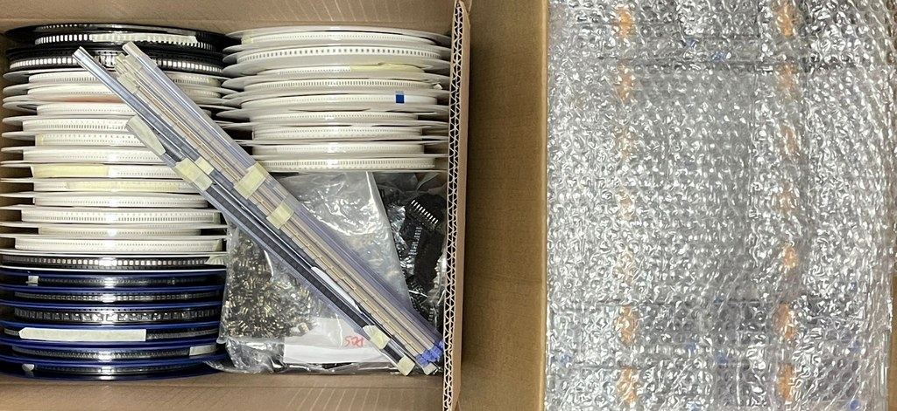

# Bill of Materials REV10(a)

REV10 is the first production version (from January 2024) that ships in an enclosure. Find your revision number on the PCB near the production date (bottom) and the 10 pin connector (top). 

import FooterCart from '/_common/_footer/_footer-cart.md' 

<FooterCart/>

## Change Log
REV10 started as a [BOM cleanup](https://forum.buspirate.com/t/analog-parts-notes-for-rev9/24), but also addresses [two issues in REV8](https://forum.buspirate.com/t/rev10-nand-flash-and-analog-mux-update/105).
- Changed low voltage op-amp (Microchip MCP6001/Gainsil GS6001) to jellybean part LMV321
- Changed current sense op-amp to 'A' graded jellybean part LMV321A for better accuracy
- Changed low voltage comparator (RUNIC RS8901XF) to jellybean part LMV331
- Changed PFETs (Winsok WST3423) to jellybean part SI2301, changed package to SOT-523
- Changed 1N4148 package to SOD-523
- Replaced 74HC4066 with 8 x SI2301 PFETs to save board space and ease sourcing
- Changed 74HC4067 to "improved" jellybean CD4067 for cost savings and availability
- Changed CD4067 series protection resistors (510R) to match current limits of pin diodes
- Changed all 74-series logic chips (Nexperia/TI) to cheaper/improved WuXi I-Core brand
- Replaced removable flash socket with onboard 1Gbit NAND flash (MT29F1G01ABAFDWB-IT:F) to improve internal SPI bus speed
- Added 1 RGB side LED and 1 RGB mini-e LED were flash socket was previously mounted
- Added 2 x LMV324 quad op-amp buffer and BAS40-05T-7-F Schottky protection diodes in front of analog mux to eliminate glitches on IO pins. Added a similar LMV321 single op-amp and protection diode to the VOUT measurement pin
- Added pinout silkscreen to 10P connector
- Swapped power supply PWM pins (GPIO22, GPIO23) and LCD control pins (GPIO24, GPIO25) to free up hardware PWM channels
- Compacted the last four bits of the analog mux to improve sweep speed

## Bill of Materials

| Brand | Part | Package | Description| Reel Quantity | Supplier |Changes|
|-|-|-|-|-|-|-|
| SAMSUNG(三星) | CL05B104KO5NNNC| 0402| 100nF ±10% 16V | 10000 |SZRCD|
| SAMSUNG(三星) | CL05C150JB5NNNC| 0402| 15pF ±5% 50V | 10000 |SZRCD|
| SAMSUNG(三星) | CL05A225MP5NSNC| 0402| 2.2uF ±20% 10V | 10000 |SZRCD|
| SAMSUNG(三星) | CL05A475KP5NRNC| 0402| 4.7uF ±10% 10V | 10000 |SZRCD|
| SAMSUNG(三星) | CL05C121JB5NNNC| 0402| 120pF ±5% 50V | 10000 |SZRCD|
| UNI-ROYAL(厚声) | 0402WGF1003TCE | 0402| 100K ±1% | 10000 |SZRCD|
| UNI-ROYAL(厚声) | 0402WGF1023TCE | 0402| 102K ±1% | 10000 |SZRCD|
| UNI-ROYAL(厚声) | 0402WGF1002TCE | 0402| 10K ±1%| 10000 |SZRCD|
| UNI-ROYAL(厚声) | 0402WGF1333TCE | 0402| 133K ±1% | 10000 |SZRCD|
| UNI-ROYAL(厚声) | 0402WGF1001TCE | 0402| 1K ±1% | 10000 |SZRCD|
| UNI-ROYAL(厚声) | 0402WGJ0511TCE | 0402| 510R ±1% | 10000 |SZRCD|Value|
| UNI-ROYAL(厚声) | 0402WGF2000TCE | 0402| 200R ±1% | 10000 |SZRCD|
| UNI-ROYAL(厚声) | 0402WGF220JTCE | 0402| 22R ±1%| 10000 |SZRCD|
| UNI-ROYAL(厚声) | 0402WGF3300TCE | 0402| 330R ±1% | 10000 |SZRCD|
| UNI-ROYAL(厚声) | 0402WGF3302TCE | 0402| 33K ±1%| 10000 |SZRCD|
| UNI-ROYAL(厚声) | 0402WGF1003TCE | 0402| 5.1K ±1% | 10000 |SZRCD|
| UNI-ROYAL(厚声) | 4D02WGJ0104TCE | 0402x4| 100K ±5% | 10000 |SZRCD|
| UNI-ROYAL(厚声) | 4D02WGJ0103TCE | 0402x4| 10K ±5%| 10000 |SZRCD|
| UNI-ROYAL(厚声) | 4D02WGJ0105TCE | 0402x4| 1M ±5% | 10000 |SZRCD|
| UNI-ROYAL(厚声) | 4D02WGJ0511TCE | 0402x4| 510R ±5%| 10000 |SZRCD|Value|
| UNI-ROYAL(厚声) | 4D02WGJ0331TCE | 0402x4| 330R ±5% | 10000 |SZRCD|
| UNI-ROYAL(厚声) | 0805W8J0330T5E | 0805| 33R ±5%| 5000|SZRCD|
| Ta-i Technology (大毅科技)| RLP25FEER200 | 2515| 0R2 ±1% 2W | 4000|SZRCD|
| FH(风华)  | CBW201209U300T | 0805| 1.5A Ferrite Bead| 4000|SZLCSC|Part, Manuf|
| CBI (创基)| 1N4148WT| SOD-523 | 100V 150mA | 3000|CBI (创基)|Package|
| CBI (创基)| BAS40-05T-7-F|SOT-523|Schottky Diode x 2| 3000|CBI (创基)|New|
| CBI (创基)| MMBT7002K | SOT-23|NFET| 3000|CBI (创基)|
| CBI (创基)| BC2301(2.8A) | SOT-523|PFET| 3000|CBI (创基)|Part, Package, Manuf|
| CBI (创基)| MMDT3906| SOT-363/SC-70-6 |Dual PNP| 3000|CBI (创基)|
| DIODES(美台)| BCM857| SOT-363/SC-70-6 |Dual PNP matched pair| 3000|SZLCSC|
| YXC (扬兴晶振) | X322512MSB4SI| 3225| 12MHz ±10ppm 20pF| 3000|Navia|
| MICRONE(南京微盟) | ME6211A33PG-N | SOT-89-3|3.3V VREG| 1000|Navia|
| DIODES(美台)| AP2127K-ADJTRG1| SOT-23-5|0.8V-5.5V 400mA VREG| 3000|Navia|
| Gainsil(聚洵) | LMV321 | SOT-23-5|R2R op-amp| 3000|Gainsil(聚洵)|Part, Footprint, Manuf|
| Gainsil(聚洵) | LMV321A (GS321A) | SOT-23-5|R2R op-amp A grade| 3000|Gainsil(聚洵)|Part, Footprint, Manuf|
| Gainsil(聚洵) | LMV324 (GS324MT)| TSSOP-14 |R2R op-amp x 4| 3000|Gainsil(聚洵)|New|
| Gainsil(聚洵) | LMV331 (GSV331) | SOT-23-5|Comparator| 3000|Gainsil(聚洵)|Part, Footprint, Manuf|
| Raspberry Pi| RP2040| QFN-56|Microcontroller|500|SZLCSC|
| Winbond | W25Q128JVSIQ| SOP-8 |128Mbit Flash|2000|SZLCSC|
| Micron | MT29F1G01ABAFDWB-IT:F|UPDFN-8|1Gbit NAND flash|4000|SZLCSC|New|
| I-CORE(中微爱芯) | AIP74HC595TA | TSSOP-16|Shift register| 2500|DXZH|Manuf|
| I-CORE(中微爱芯) | AIP74HCT245TA| TSSOP-20|Level shifter|2500|DXZH|Manuf|
| I-CORE(中微爱芯) | CD4067| TSSOP-24|16 channel analog mux| 2500|DXZH|Manuf, Part|
| I-CORE(中微爱芯) | AIP74LVC1T45| SOT-363/SC-70-6 |Buffer| 3000|DXZH|Manuf|
| CGL LED | SK6812-mini-e | |LED down facing|2000|CGL LED|
| CGL LED | SK6812-side-a_b | |LED side facing|2000|CGL LED|
| SZHTC | QT200H1201| |320x240 Display| |SZHTC|
| KAIDI |TJC8-10AW|1x10 P2.54mm horizontal male| main IO connector **with silkscreen**|1000|KAIDI|Added pinout silkscreen|
| SZWG |1x03 P2.54mm vertical female milled, low profile|1x03 P2.54|Programming connector| |SZWG|
| SZYC | SH 1.0-9P WT|"SH" 1x09 P1.00mm horizontal male|AUX connector|Tube|SZYC|
| SHOU HAN(首韩) | TYPE-C-31-M-12| |USB C 16P|1000|SHOU HAN(首韩)|
| SHOU HAN(首韩) | TS3425BA 098 2.5H 250gf|4.2x3.4x2.5mm|4x3x2.5H button 250gf|3000|SHOU HAN(首韩)|
| SHOU HAN(首韩) | TS3315A 250gf 025 |3.3x3.3x1.5mm|3x3x2.5H button 250gf|4000|SHOU HAN(首韩)|

- Manuf = Change of part manufacturer (may or may not be drop in replacement)
- Package = Change of part size
- Part = Change of part number that requires FCC recertification
- Footprint = Part required a PCB footprint change
- Value = Value of part changed/new part value on this BOM revision
- New = New component in this revision

## Get Bus Pirate 5
import FooterGet from '/_common/_footer/_footer-get.md' 

<FooterGet/>