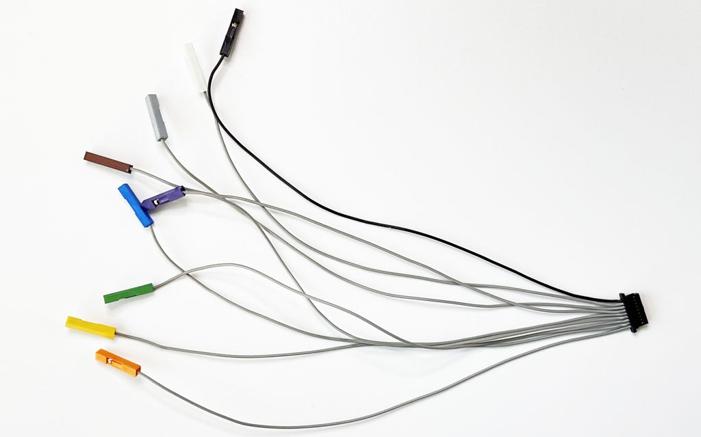

# Cables

import OldSiteWarning from '/old-site-warning.md'

<OldSiteWarning/>

All Bus Pirate cables are made with super soft and flexible premium silicone coated wire. The inner strands are very fine tinned copper. 22AWG has 60 strands 0.08mm thick (bottom), compared to 8-12 strands in common wires (top). The silicone coating has a very nice feel, and tolerates high heat and chemicals.

import FooterCart from '/_common/_footer/_footer-cart.md' 

<FooterCart/>

## Probe Cable

|Pin|Wire Type|Wire Color|Wire Length|Shrink Type|Shrink Color|Shrink Manuf|Shrink Length|Shrink Text|Shrink Text Color|
|-|-|-|-|-|-|-|-|-|-|
|1|22AWG Silicone|Red|270mm|φ1.5mm|Red|Woer|20mm|VOUT VOUT|Black|
|2|22AWG Silicone|Gray|270mm|φ1.5mm|Orange|Dongguan Sanlian|20mm|IO0 IO0|Black|
|3|22AWG Silicone|Gray|270mm|φ1.5mm|Yellow|Woer|20mm|IO1 IO1|Black|
|4|22AWG Silicone|Gray|270mm|φ1.5mm|Green|Dongguan Sanlian|20mm|IO2 IO2|Black|
|5|22AWG Silicone|Gray|270mm|φ1.5mm|Blue|Dongguan Sanlian|20mm|IO3 IO3|Black|
|6|22AWG Silicone|Gray|270mm|φ1.5mm|Purple|Dongguan Sanlian|20mm|IO4 IO4|Black|
|7|22AWG Silicone|Gray|270mm|φ1.5mm|Brown|Dongguan Sanlian|20mm|IO5 IO5|Black|
|8|22AWG Silicone|Gray|270mm|φ1.5mm|Gray|Woer|20mm|IO6 IO6|Black|
|9|22AWG Silicone|Gray|270mm|φ1.5mm|White|Woer|20mm|IO7 IO7|Black|
|10|22AWG Silicone|Black|270mm|φ1.5mm|Black|Woer|20mm|GND GND|White|

A high quality probe cable to connect the Bus Pirate to test hooks, milled breadboard pins and pin header.

### TJC8 connector
Keyed, locking 2.54mm female connector. TJC8 or HX25418.

### Unhoused 2.54mm crimps
2.54mm 'DuPont' female crimps, without a housing. Many test probes will now accept a 2.54mm Dupont crimp housing, but many don't. The probe cable uses unhoused crimps wrapped with color coded, labeled shrink tube.

### Printed Shrink Tube

Shrink tube varies wildly in color quality. A lot of colors just don't pop: dull lifeless pastels or just too dark. We ended up sourcing from two manufacturers to get a reasonably nice set of colors. Woer is able to print on the shrink tube, and also printed on the tubes from Dongguan Sanlian.

## Auxiliary Cable 

|Pin|Wire Type|Wire Color|Wire Length|Connector 1| Connector 2|Bus Pirate Signal|
|-|-|-|-|-|-|-|
|1-8|30AWG Silicone|Gray|170mm|9pin 1.0mm 'SH', female|1pin 2.54mm 'DuPont', female|IO0-IO7|
|9|30AWG Silicone|Black|170mm|-|1pin 2.54mm 'DuPont', female|Ground|

A 9 pin cable connects the Bus Pirate auxiliary connector to external tools like logic analyzers, oscilloscopes etc. 

The first version of this cable had all black crimp housings and it was a pain to find the right tiny wire. We sourced white plastic crimp housings and [dyed them to match the color labels](https://forum.buspirate.com/t/dyed-abs-button-caps/119) on the display and probe cable. Just for fun we dyed the SH connector black as well. Now it's a lot easier to use.

:::note
The first version of the auxiliary cable has all back crimp housings. The second version has color coded crimp housings. Version one is in the current auxiliary cable kit, version 2 is available separately until we receive matching Y and splitter cables to make a kit.
:::

:::info
ABS plastic can be dyed. The supplier is a factory that specializes in dying plastic clothing buttons and beads. First they do a material test with a random color. If everything looks good, they quote a price per gram of plastic dyed. We also used this technique to [color button caps](/enclosure/hardware#dyed-plastic-button-caps) for the enclosure.
:::

## Y Splitter Cable

|Pin|Wire Type|Wire Color|Wire Length|Connector 1| Connector 2|
|-|-|-|-|-|-|
|1|22AWG Silicone|Black/Red/Gray|170mm|1pin 2.54mm 'DuPont', female|2*1pin 2.54mm 'DuPont', female|

A high quality splitter cable to make multiple connections to a single pin. Connect power and ground to multiple devices, or share a 1-Wire, I2C or SPI bus between several chips.

## Jumper Cable

|Pin|Wire Type|Wire Color|Wire Length|Connector 1| Connector 2|
|-|-|-|-|-|-|
|1|22AWG Silicone|Black/Red/Gray|170mm|1pin 2.54mm 'DuPont', female|1pin 2.54mm 'DuPont', female|

A high quality jumper wire to quickly connect your latest breakout board.

## Get Bus Pirate 5
import FooterGet from '/_common/_footer/_footer-get.md' 

<FooterGet/>

