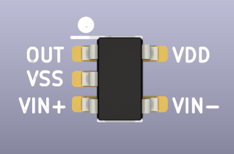

# Analog Components

## Op-amp rail to rail SOT-23-5

|**Reference**|**Package**|**Value**|**Quantity**|**Rating**|**Note**|
|-|-|-|-|-|-|
|U404, U603|SOT-23-5|LMV321  |2  |5 volts  |R2R, Vos ~0.4V typical, ~3.5V max  |

General purpose rail to rail op-amp with >1MHz GBP in SOT-23-5 package. 

LMV321 is a generic part number available from multiple manufacturers, but they are not created equal. From the appearance of the datasheets, there are four common dies used in this component by most manufacturers. The best quality die has 0.4 volt typical offset voltage (3.5 volts max @ 25C).

Example:

*   [LMV321](https://item.szlcsc.com/336841.html) (Gainsil) 
*   [GS321](https://item.szlcsc.com/169043.html) (Gainsil)
*   [LMV321](https://item.szlcsc.com/7814926.html) (HXY MOSFET)

## Quad op-amp rail to rail TSSOP-14

|**Reference**|**Package**|**Value**|**Quantity**|**Rating**|**Note**|
|-|-|-|-|-|-|
|???|TSSOP-14|LMV324  |2  |5 volts  |R2R, Vos ~0.4V typical, ~3.5V max  |

General purpose quad rail to rail op-amp with >1MHz GBP in TSSOP-14 package. 

LMV324 is a generic part number available from multiple manufacturers, but they are not created equal. From the appearance of the datasheets, there are four common dies used in this component by most manufacturers. The best quality die has 0.4 volt typical offset voltage (3.5 volts max @ 25C).

Example:

*   [LMV324IPWR](https://item.szlcsc.com/381452.html) (TI) 
*   [LMV324MT](https://item.szlcsc.com/3498017.html) (HGSemi)

## Op-amp rail to rail SOT-23-5 A grade

|**Reference**|**Package**|**Value**|**Quantity**|**Rating**|**Note**|
|-|-|-|-|-|-|
|U602|SOT-23-5|LMV321A  |1  |5 volts  |R2R, Vos ~0.1V typical, ~0.4V max  |

General purpose rail to rail op-amp with >1MHz GBP in SOT-23-5 package. This op-amp is used in the current sense circuit and is more sensitive to input offset, so a better quality part can be used.

LMV321A is graded version of LMV321 available from several manufacturers. Aim for 0.1 volt typical offset voltage (0.4 volts max @ 25C).

:::tip
The same general purpose part used for U404 and U603 can also be used. It's not necessary to have a higher quality graded component, however the current sense will not be as accurate.
:::

Example:

*   [LMV321AS5X](https://item.szlcsc.com/165892.html) (On Semi) 
*   [GS321A](https://item.szlcsc.com/427641.html) (Gainsil)
*   [LMV321A](https://item.szlcsc.com/3027065.html) (3PEAK)

## Comparator SOT-23-5

|**Reference**|**Package**|**Value**|**Quantity**|**Rating**|**Note**|
|-|-|-|-|-|-|
|U602  |SOT-23-5|LMV331|1  |5 volts  | 

General purpose comparator in SOT-23-5 package. LMV331 is a generic part number used by a multitude of small manufacturers.

Example:

*   [LMV331IDBVR](https://item.szlcsc.com/35702.html) (TI)
*   [LMV331](https://item.szlcsc.com/8395212.html) (Tech Public)
*   [GSV331](https://item.szlcsc.com/3256341.html) (Gainsil)
*   [HGV331](https://item.szlcsc.com/5691724.html) (HG Semi)