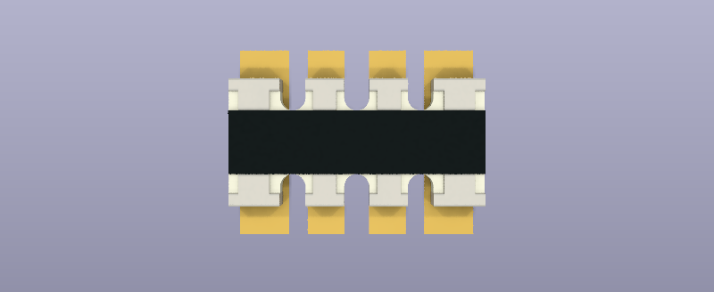

# Passive components

## Resistors 1% 0402

|**Reference**|**Package**|**Value**|**Quantity**|**Rating**|**Note**|
|-|-|-|-|-|-|
|R201 R204|0402|5.1K|2|\>=1/16th Watts|1%|
|R202 R203|0402|22R|2|\>=1/16th Watts|1%|
|R401 R412|0402|100K|2|\>=1/16th Watts|1%|
|R403|0402|102K|1|\>=1/16th Watts|1%|
|R101 R502 R602 R603|0402|1K|4|\>=1/16th Watts|1%|
|R405 R408 R409 R604 R605|0402|33K|5|\>=1/16th Watts|1%|
|R104 R105 R312 R402 R406 R407 R410 R501 R606 R609 R610 R611 R613|0402|10K|13|\>=1/16th Watts|1%|
|R103 R208 R608 R612 R614 R615|0402|200R|6|\>=1/16th Watts|1%|
|R404|0402|133K|1|\>=1/16th Watts|1%|
|??|0402|510R|?|\>=1/16th Watts|1%|

*   Manufacturers: Any. We've been using UniRoyal (UniOhm/RoyalOhm).

Any standard quality 1% resistor can be used.

:::tip
1K (R602, R603), 33K (R405, R604, R605), 102K (R403), 133K (R404) are used in analog circuits. Confirm they are 1% tolerance.
:::

## Resistor arrays 5% 0402x4 convex

|**Reference**|**Package**|**Value**|**Quantity**|**Rating**|**Note**|
|-|-|-|-|-|-|
|RN301 RN305 RN306 RN309 RN313 RN314 RN400 RN401 RN402|0402x4 convex|330R|9|\>=1/16th Watts|5%|
|??|0402x4 convex|510R|4|\>=1/16th Watts|5%|
|RN311 RN312|0402x4 convex|10K|2|\>=1/16th Watts|5%|
|RN303 RN308 (NEW??)|0402x4 convex|100K|2|\>=1/16th Watts|5%|
|RN302 RN304 RN307 RN310|0402x4 convex|1M|4|\>=1/16th Watts|5%|

Any standard quality 5% 0402x4 resistor array can be used. Convex type (leads on the tips of each resistor). We've been using UniRoyal (UniOhm/RoyalOhm).

## Resistor 5% 0805

|**Reference**|**Package**|**Value**|**Quantity**|**Rating**|**Note**|
|-|-|-|-|-|-|
|R209|0805|33R|1|\>=1/10th Watts|5%|

Any standard 5% resistor can be used. This is a current limiting resistor for the LCD back-light, tolerance is not important. We've been using UniRoyal (UniOhm/RoyalOhm).

## Resistor 0.2R 1% 2W 2512

|**Reference**|**Package**|**Value**|**Quantity**|**Rating**|**Note**|
|-|-|-|-|-|-|
|R601|2512|0.2R|1|\>=2 Watts|1%, <=100ppm/C|

Any standard 1% 2512 package resistor can be used. It is best to have the lowest ppm/C possible. 50-100ppm/C is inexpensive and readily available.

*   [RLP25FEER200](https://item.szlcsc.com/464030.html)
*   [STE2512S2W0R200F](https://item.szlcsc.com/202636.html)
*   [HoGT2512-2W-200mR-1%](https://item.szlcsc.com/899646.html) 

## Ceramic Capacitors 10 or 16 volts 0402

|**Reference**|**Package**|**Value**|**Quantity**|**Rating**|**Note**|
|-|-|-|-|-|-|
|C105 C106|0402|15pF|2|>=10 volts||
|C103 C110 C111 C112 C113 C114 C115 C116 C117 C118 C301 C302 C303 C304 C305 C306 C307 C308 C309 C310 C311 C312 C313 C314 C315 C316 C317 C318 C403 C406 C501 C502 C503 C602 C605 C701 C702 C703 C704 C705 C706 C707 C708 C710 C712 C713 C714 C715 C716 C717 C718|0402|0.1uF|51|>=10 volts|
|C104 C107 C108 C109 C402 C405 C601|0402|2.2uF|6|>=10 volts|
|C101 C102 C201 C202 C401 C404 C407|0402|4.7uF|8|>=10 volts|<2ohms ESR|
|C408|0402|120pF|1|>=10 volts||

*   Manufacturers: Any. We use Samsung.

Any standard quality capacitors rated for 10 volts or more can be used. 

:::warning
4.7uF is used with voltage regulators and should be a "low ESR" type with 2ohm or less ESR.
:::

## Diode 1N4148 SOD-323

|**Reference**|**Package**|**Value**|**Quantity**|**Rating**|**Note**|
|-|-|-|-|-|-|
|D401 D601 D602 D603|SOD-323|1N4148|4||

Standard 1N4148 diode, any manufacturer.

:::tip
Several manufacturers make a 1N4148 diode and also several of the transistors in this BOM. See the table in the Transistors and FETs section of the sourcing guide.
:::

## Dual Schottky Diode BAS40 SOT-523

|**Reference**|**Package**|**Value**|**Quantity**|**Rating**|**Note**|
|-|-|-|-|-|-|
|???|SOT-523|BAS40-05T|5||common cathode|

Dual Schottky diodes with very low reverse leakage (<=6nA @ 5volts T=25c) and low forward voltage (<=0.4volt @ 0.05mA T=25c).

This diode protects op-amps connected to the IO pins from damage due to reverse current when reverse powered. The forward voltage **must** be less than 0.5volts with some margin to spare. 

:::tip
In our experience the generic equivalent parts are very leaky, so we use genuine Diodes INC parts in REV10. We continue to investigate cheaper alternatives for future revisions.
:::

* [BAS40-05T-7-F](https://item.szlcsc.com/145670.html) (Diodes INC)

## Ferrite Bead 1.5A 0805

|**Reference**|**Package**|**Value**|**Quantity**|**Rating**|**Note**|
|-|-|-|-|-|-|
|L201|0805|Ferrite bead|1|\>=1.5A|<100Ohms @ 100MHz|

This ferrite bead filters RF interference to/from the USB cable. The part must be rated for 1.5Amps or more, but the other values are not critical. Ideally it should have less than 100Ohms resistance at 100MHz (typically 15 or 30Ohms @ 100MHz). Tolerance is not important, typically +/-25%.

:::tip
The same bead used on the previous Bus Pirate versions will work.
:::

Examples:

*   [MMZ1608Y300BTD25](https://item.szlcsc.com/429984.html)
*   [MMZ1608R150ATD25](https://item.szlcsc.com/429982.html)
*   [SCBM201209U300T](https://item.szlcsc.com/505537.html)

