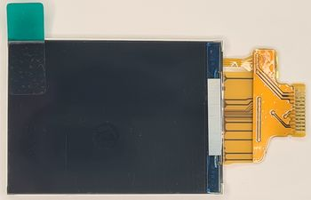
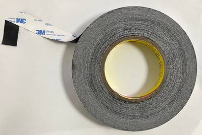
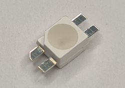
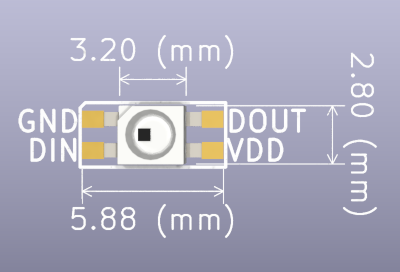
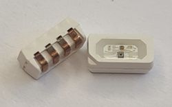
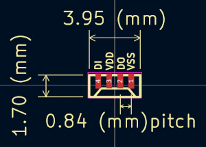
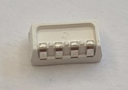

# LEDs and Display

import OldSiteWarning from '/old-site-warning.md'

<OldSiteWarning/>

## LCD 2.0" IPS LCD 240x320 ST7789V with SPI interface (QT200H1201)

|**Reference**|**Package**|**Value**|**Quantity**|**Rating**|**Note**|
|-|-|-|-|-|-|
|LCD201|TFT\_20|QT200H1201|1||

2 inch IPS LCD, all angle viewing, 240x320 pixels. ST7789V controller chip with SPI interface. Solderable flex PCB connector.

Supplier:

*   [QT200H1201](https://item.taobao.com/item.htm?id=581793017604)

## Double sided tape, insulating, 20mm, <0.2mm thick

Tape secures the LCD to the PCB, and insulates the flex PCB connector from contact with the metal LCD RF shield. 

Example:

* 3M 9448A 20mm width

## LED SK6812-MINI-E, LED6028 / 3528

|**Reference**|**Package**|**Value**|**Quantity**|**Rating**|**Note**|
|-|-|-|-|-|-|
|LED702 LED703 LED705 LED706 LED710 LED713 LED714 LED715 LED718 LED719|LED6028|SK6812-mini-e|10|

SK6812 RGB LED that mounts lens-down and shines through a hole in the PCB. Commonly used to light RGB keyboards. 

- REV10+ adds 1 additional SK6812-mini-e

Example:

*   [SK6812-mini-e](https://item.taobao.com/item.htm?spm=a1z09.2.0.0.4dfd2e8dXJuwqu&id=636757374631&_u=626q2r6fe46d)

## LED SK6812-SIDE-A, 4020 / 4.0x2.0x1.6mm

|**Reference**|**Package**|**Value**|**Quantity**|**Rating**|**Note**|
|-|-|-|-|-|-|
|LED701 LED704 LED707 LED708 LED712 LED716 LED717 LED720|4020|SK6812-side-a|8||

SK6812 RGB LED with side mounted lens. Commonly used on RGB LED strips. Available from multiple manufacturers. 

- REV10+ adds 1 additional SK6812-side-a

:::caution
There are two common footprints for SK6812-side-a. The preferred part has evenly spaced pads that bend 90 degrees and extend up the back of the part. We have had the best success reflow soldering this footprint, and it is MUCH easier to hand rework.
:::

Yes, the LED in the photo is badly oxidized. It was the only one we had on hand for the photo and it's been sitting out for over a year. Only new, packaged and protected LEDs should be used for manufacturing.

Example:

*   [SK6812-side-a](https://item.taobao.com/item.htm?spm=a1z09.2.0.0.1a572e8daQXham&id=630965496117&_u=j26q2r6f7f04)

_**Alternatives (requires PCB footprint change):**_

This version of the SK6812-side-a has a slightly different footprint. We avoid it if possible.
:::warning
We had the following issues with this part:
*   Poor pick and place performance because the top of the package is at an angle
*   Poor reflow performance (>50% need hand rework)
*   Difficult to rework because the pads are hidden under the package
:::
Example:

*   [SK6812-side-a](https://item.szlcsc.com/3113216.html)
