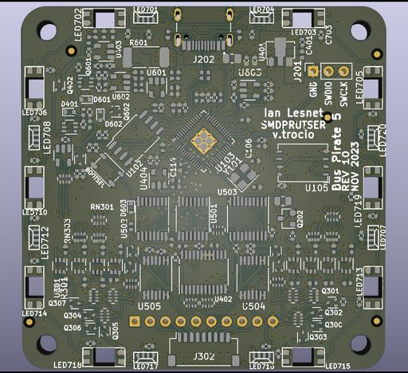

# Printed Circuit Board

## PCB 4 layers 60x60mm

|**Reference**|**Package**|**Value**|**Quantity**|**Rating**|**Note**|
|-|-|-|-|-|-|
|PCB  |60x60mm|4 layer PCB|1  ||FR4 1oz outer copper, 0.25oz inner copper|

Standard FR4 with 1oz top/bottom copper, 0.25oz internal copper.

### Bottom

Components are placed on the bottom layer of the PCB by a pick and place machine. The through-hole 10P connector is hand soldered after reflow.

### Top

The display, button and programming header are hand soldered to the top side of the PCB.