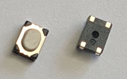
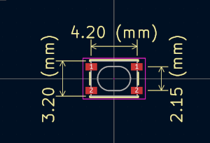
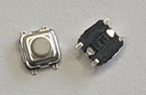
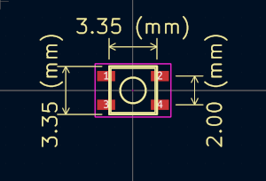

# Switches

import OldSiteWarning from '/old-site-warning.md'

<OldSiteWarning/>

## SPST 4.2x3.2mm

|**Reference**|**Package**|**Value**|**Quantity**|**Rating**|**Note**|
|-|-|-|-|-|-|
|SW101|4.2x3.2 (PTS810)|Switch SPST|1||  

This is the same switch used on the Raspberry Pi Pico board to enter bootloader mode. Any similar switch is fine.

Example:

*   [PTS810SJM250SMTRLFS](https://item.szlcsc.com/117755.html "PTS810SJM250SMTRLFS ") (C&K) 
*   [PTS810SJK250SMTRLFS](https://item.szlcsc.com/222326.html "PTS810SJK250SMTRLFS ") (C&K) 
*   [GT-TC048A-H025-L1](https://item.szlcsc.com/826767.html) (G-Switch) 
*   [YTSA016A0252501B](https://item.szlcsc.com/1054564.html) (DGBZ) 
    
## SPST 3.3x3.3mm, 1.5mmH

|**Reference**|**Package**|**Value**|**Quantity**|**Rating**|**Note**|
|-|-|-|-|-|-|
|SW102, SW103, SW104|3.3x3.3x1.5H|Switch SPST 250gf  |3||250gf activation force|

3.3mmx3.3mm switch, 1.5mm total height, 250gf activation force. Any manufacturer.

Example:

*   [GT-TC026B-H015-L1](https://item.szlcsc.com/826763.html)