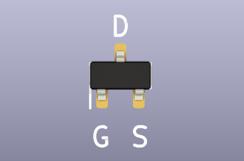
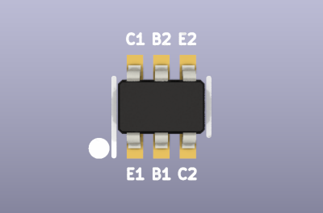

# Transistors and MOSFETs

import OldSiteWarning from '/old-site-warning.md'

<OldSiteWarning/>

## Consolidating suppliers

|Manufacturer|2N7002|SI2301|MMDT3906|1N4148 (diode)|
|-|-|-|-|-|
|YONGYUTAI/KUU(永裕泰)|2N7002|SI2301|-|1N4148|
|CBI(创基)|2N7002|BC2301(2A)|MMDT3906|1N4148|
|JSMSEMI(杰盛微)|2N7002|SI2301|-|1N4148|

:::tip
We used jellybean parts that are available from several manufacturers under the same part number. Choosing all one manufacturer saves a bit on parts and shipping, and simplifies sourcing.
:::

## NMOS FET 200mA+ Vgs<=1.5 volts SOT-23 

|**Reference**|**Package**|**Value**|**Quantity**|**Rating**|**Note**|
|-|-|-|-|-|-|
|Q202|SOT-23|NMOS FET (2N7002/BSS138)|1|\>=200mA|Vgs<=1.5 volts|

This FET switches the LCD backlight which uses 60mA/5volts. Any N-channel MOSFET with similar pinout capable of switching 150mA with a low Vgs (<2.5 max) will work.

BSS138 is an N-channel MOSFET capable of switching 200mA, and has a 0.8-1.5 volt Vgs (1.3 volt typical). This part is available from many, many manufacturers.

2N7002 is a substitute N-channel MOSFET with the same pinout. 340mA maximum current, but with a higher maximum Vgs (1-2.5 volts, 1.5 volt typical).

Examples:

*   [BSS138](https://item.szlcsc.com/3080012.html "BSS138 ") (JSMSEMI) 
*   [BSS138](https://item.szlcsc.com/753813.html "BSS138 ") (LGE) 
*   [BSS138](https://item.szlcsc.com/420488.html "BSS138 ") (Sikor)
*   [BSS138](https://item.szlcsc.com/113471.html "BSS138 ") (ShiKues) 
*   [BSS138W-7-F](https://item.szlcsc.com/25293.html "BSS138W-7-F ") (Diodes INC)
*   [2N7002](https://item.szlcsc.com/990892.html "2N7002 ") (JSMSEMI) 
*   [2N7002](https://item.szlcsc.com/364336.html "2N7002 ") (YangJie) 
*   [2N7002](https://item.szlcsc.com/9040.html "2N7002 7002 ") (CJ) 
*   [2N7002K-7](https://item.szlcsc.com/86219.html) (Diodes INC)

## PMOS FET 2A+ Vgs>=-1 volts SOT-523 

|**Reference**|**Package**|**Value**|**Quantity**|**Rating**|**Note**|
|-|-|-|-|-|-|
|Q300 Q301 Q302 Q303 Q304 Q305 Q306 Q307 Q402 Q602|SOT-523|PMOS FET (SI2301)|10|\>=2A|Vgs>=-1 volts, Pd>=300mW, RDSon<=150mOhms|

Any P-channel MOSFET with similar pinout capable of switching 2A+ with a low Vgs (-1 volts max) will work. On-state resistance should be low, under 150mOhms. Power dissipation is only around 50mW depending on the on-state resistance, so most parts will work (Pd>=300mW). 

- REV10+ replaces Winsok WST3423 with SI2301 for cost and availability
- REV10+ replaces SOT-23 with a smaller SOT-523 package part. The internal die is identical to the larger package
- REV10+ replaces 74HC4066 with 8 x SI2301 to control the onboard pull-up resistors

:::caution
Generic part number SI2301 is available from multiple manufacturers, but SOT-523 may be a special order package.
:::

Example:

* BC2301(2A) (CBI)

## Dual PNP transistor general purpose SOT-363/SC-70-6

|**Reference**|**Package**|**Value**|**Quantity**|**Rating**|**Note**|
|-|-|-|-|-|-|
|Q601|SOT-363/SC70-6|Dual PNP BJT (MMDT3906)|1|\>=200mA|general purpose|

Q601 is a general purpose dual PNP transistor with EBCEBC pinout. 

:::tip
Matched pair Q401 can be substituted for Q601, but Q401 is more expensive.
:::

Example:

*   [MMDT3906](https://item.szlcsc.com/1055270.html) (YangJie)
*   [MMDT3906DW K3N](https://item.szlcsc.com/3001696.html) (CBI) 
*   [MMDT3906 R1 00001](https://item.szlcsc.com/296018.html) (PanJit)
*   [MMDT3906-7-F](https://item.szlcsc.com/521897.html "MMDT3906-7-F ") (Diodes INC) 

## Dual PNP transistor matched pair SOT-363/SC-70-6 

|**Reference**|**Package**|**Value**|**Quantity**|**Rating**|**Note**|
|-|-|-|-|-|-|
|Q401|SOT-363/SC70-6|Dual PNP BJT (BCM857)|1|\>=100mA|

Closely matched PNP transistor pair.

|**Symbol**|**Parameter**|**Conditions**|**Min**|**Typ**|**Max**|**Unit**|
|-|-|-|-|-|-|-|
|hFE1/hFE2|hFE matching|VCE=-5V; IC=-2mA|0.9|1|-|-|
|VBE1-VBE2|VBE matching|VCE=-5V; IC=-2mA|-|-|2|mV|

Q401 requires a closely matched PNP transistor pair. The hFE of the transistor pair should differ by no more than 10%, and the VBE should differ no more than 2mV.

:::tip
BCM857 is a matched PNP pair with EBCEBC pinout. BCM856 or NST45010MW6T1G can be substituted at greater expense. The BCM85x part numbers are made by several manufacturers (Nexperia, Diodes INC). We could not find a local Chinese manufacturer.
:::

Example:

*   [BCM857BS-7-F](https://item.szlcsc.com/107111.html "BCM857BS-7-F ") (Diodes INC) 0.55 RMB
*   [BCM857BS,115](https://item.szlcsc.com/107102.html "BCM857BS,115 ") (Nexperia) 0.66 RMB

_**Alternatives (requires PCB change)**_

DMMT3906, PMP5201, PMP5501 are similar but have a different (BBCEEC) pinout. These can be substituted **with minor changes to the PCB**. DMMT3906 is generally the cheapest matched pair dual PNP, but it is only made by Diodes INC and is currently difficult to source.

:::tip
The part chosen for Q401 may also be used for Q601 (with modified PCB if using DMMT3906 or similar pinout). It costs significantly more than a general purpose PNP transistor pair, but might be useful to reduce the BOM or save a pick and place feeder.
:::

