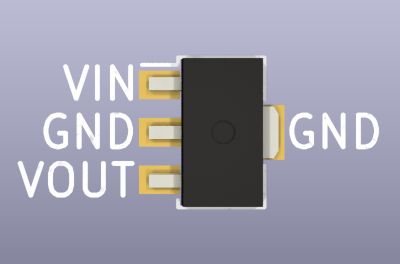
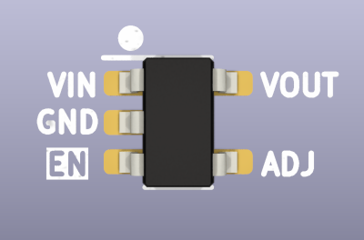

# Voltage Regulators

import OldSiteWarning from '/old-site-warning.md'

<OldSiteWarning/>

## LDO voltage regulator 3.3volts 200mA+ 1% accuracy SOT-89

|**Reference**|**Package**|**Value**|**Quantity**|**Rating**|**Note**|
|-|-|-|-|-|-|
|U401  |SOT-89|3.3volt LDO  |1|200mA+  |\>=2% accuracy|

3.3volt power supply for the main components. Should support 150mA minimum, 2% or better accuracy, short circuit protection, thermal shutdown function, drop out < 1volt, compatible with ceramic capacitors.

Example, can be any equivalent part:

*   [ME6211A33PG-N](https://item.szlcsc.com/236113.html) 1% (MicrOne)
*   [S-1206B33-U3T1U](https://item.szlcsc.com/166530.html) 1% (SII/ABLIC)
*   [AP2204RA-3.3TRG1](https://item.szlcsc.com/162965.html) 2% (Diodes INC)

## Adjustable LDO VREG with 0.8v to 5.0v output SOT-23-5

|**Reference**|**Package**|**Value**|**Quantity**|**Rating**|**Note**|
|-|-|-|-|-|-|
|U403  |SOT-23-5|AP2127K-ADJTRG1|1  ||  

Example:

*   [AP2127K-ADJTRG1](https://item.szlcsc.com/97547.html "AP2127K-ADJTRG1 ") (Diodes INC)
*   [MCP1824T-ADJE/OT](https://item.szlcsc.com/157049.html "MCP1824T-ADJE/OT ") (Microchip)

MCP1824 was used for development, but it is more expensive and harder to source than the AP2127.

:::tip
If no part can be sourced, a common 1.25V-5V adjustable regulator can be used with the correct resistor values (see calculations spreadsheet). The Bus Pirate will lose features though. The output range will be limited to 1.25volts to 5volts, instead of 0.8volts to 5volts.
:::

### Reference voltage configuration

|**Part**  |**Ideal Value**|||**Closest Value**|
|-|-|-|-|-|-|-|
||R403|R404|R405|R403|R404|R405|
|**MCP1824**|77.96K|99.22K|10K|78K|100K|10K|
|**AP2127**|103.13K|131.25K|33K|102K|133K|33K|

:::caution
MCP1824 and AP2127 are equivalent, but have different reference voltages. R403/R404/R405 need to match the regulator as shown in the table.
:::
