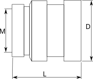
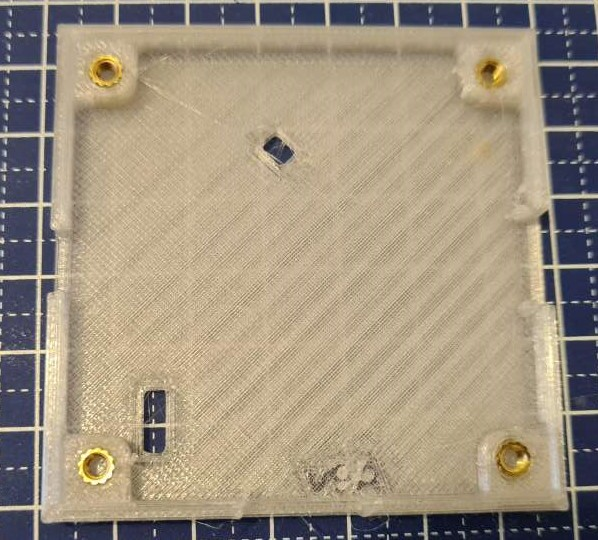
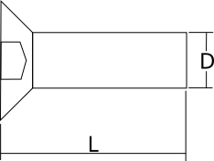

# FDM Shell

## FDM 3D printed shell

|**Reference**  |**Value  **|**Quantity  **|**Rating**  |**Note  **|
|-|-|-|-|-|
|Top shell  ||1  | |Clear PET-G material  |
|Bottom shell||1||Clear PET-G material|

Top and bottom enclosure 3D printed in clear/transparent PET-G filament. 

For large volumes it will be better to injection mold the case. The open source case will probably improve and evolve over the first few productions, so we designed it to be 3D printed in small batches at the beginning (if possible).

## M3 brass heat set knurled nuts (opposite direction knurling)

|**Reference**|**Package**|**Value**|**Quantity**|**Rating**|**Note**|
|-|-|-|-|-|-|
|Nuts  |M3x3mmLx4.5mmD|M3 brass heat set nut  |4  | |

- Opposite direction knurling 

## M3 8mm DIN7991 bolt
  

|**Reference**|**Package**|**Value**|**Quantity**|**Rating**|**Note**|
|-|-|-|-|-|-|
|Bolts|M3x8mm DIN7991|M3 8mm bolt DIN7991 silver|4||Silver color|