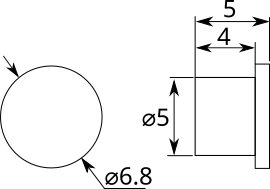
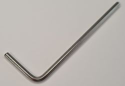

# Hardware

Common hardware for all case versions.

## SC121 button cap

|**Reference**|**Package**|**Value**|**Quantity**|**Rating**|**Note**|
|-|-|-|-|-|-|
|Button cap|5x5mm|Button cap, 5mm, metalized|1||Metalized silver|
|Button cap|5x5mm|Button cap, 5mm, dyed|3||"Arcade" red, yellow, blue*|
|Button cap|5x5mm|Button cap, 5mm, hydrographic foil dip|1||Carbon fiber*|
|Button cap|5x5mm|Button cap, 5mm, black|1||Black*|

A metalized silver button cap is installed by default. The manufacturer also sells a black version.

[pics]

After dying the AUX cable crimp housings 

[pic of carbon fiber] [pic of dip process]

## 2mm HEX wrench
  

|**Reference**|**Package**|**Value**|**Quantity**|**Rating**|**Note**|
|-|-|-|-|-|-|
|Hex key|2mm  |2mm hex key|1||DIN7991  |

A 2mm HEX wrench to open the Bus Pirate case. One key should be included with each Bus Pirate.