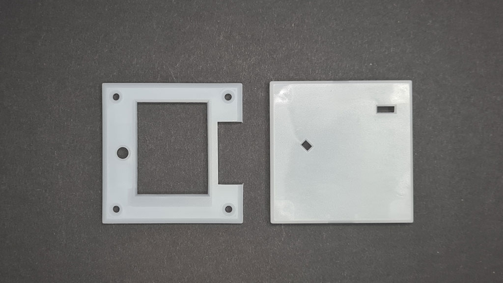
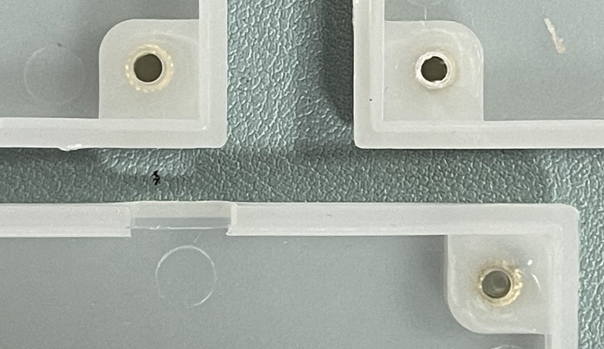

# Injection Molded Enclosure

## Components
### PP Shell

|**Reference**  |**Value  **|**Quantity  **|**Rating**  |**Note  **|
|-|-|-|-|-|
|Top shell  ||1  ||Clear PP|
|Bottom shell||1||Clear PP|

Top and bottom enclosure injection molded in clear-ish polypropylene (PP) plastic with a bit of titanium dioxide for color. 

### M3 brass insert nuts

|**Reference**|**Package**|**Value**|**Quantity**|**Rating**|**Note**|
|-|-|-|-|-|-|
|Nuts  |M3x3mmLx4.0mmD|M3 brass insert nut  |4  ||Should be 4mm height|

Brass insert nuts for injection molding. Nuts are placed into the tooling before each case is injection molded. This is labor intensive, leads to scheduling problems and the results vary.

Ideally, the nut height would be 4mm so the case works with standard 8mm bolts. Due to circumstances (see below) the factory used 3mm insert nuts. 8mm bolts hit the injection molding gunk that creeps into the base of the 3mm nut. Bolts don't always sit flush with the front of the case. The current solution is a 7mm bolt, which is a non-standard size.

Future cases will probably have a cavity on the bottom for a typical M3 nut so the molding can be fully automated.

### M3 7mm DIN7991 bolt
  

|**Reference**|**Package**|**Value**|**Quantity**|**Rating**|**Note**|
|-|-|-|-|-|-|
|Bolts|M3x**7mm** DIN7991|M3 **7mm** bolt DIN7991 silver|4||Silver color|

**7mm** bolts are a non-standard size. We're stuck with them because of clearance issues in this batch of cases. The next enclosure revision will address this issue.

:::danger
Bolts should be finger tight. Over tightening bolts may pull the insert nut out of the case, or crush the LCD.
:::

:::info
The 3D printable versions of the enclosure work with standard 8mm DIN7991 bolts, only the injection molded version specifies 7mm bolts. 8mm bolts will work, but some heads may sit fully flush with the front of the case. 
:::

### The Plug

|**Reference**|**Package**|**Value**|**Quantity**|**Rating**|**Note**|
|-|-|-|-|-|-|
|The Plug|-|Hole cover|1||White SLA|

Bus Pirate 5 REV0 to REV9 included an SD card socket. SD cards are slow in SPI mode, and slow down everything else on the shared SPI bus (LCD, IO expanders). We replaced it with a chunk of onboard NAND flash, but now there's a gaping hole in the enclosure and it's far too late to make changes.

 

In an act of desperation we [modeled a hole cover](https://github.com/DangerousPrototypes/BusPirate5-hardware/tree/main/enclosure) and SLA printed it. Despite being smaller than the allowed specs, our SLA supplier was happy to print batches of them. It turned out very well - super thin and a good color match to the case material. 

The SD card slot will be removed in a future revision of the case.

## Manufacturing Notes

We received quotes from six injection molding factories. One boss took the time to review the Bus Pirate and send photos of plastic materials/styles he thought would work well, he also offered a great price. It was off to such a great start.

### Tooling fit test

First we received a tooling fit test. This is a molding from the raw tooling to see if the insides are in the right place. There's no surface treatment yet, you can see the tooling paths on the outside of the case. 

The fit was ok, but there were no insert nuts so we couldn't fully test it. The factory said they'd be in place for the material test. 

:::danger
We later learned that this sample was made with ABS plastic, instead of PP. Mold tooling is made to accommodate the properties of specific materials. One tooling usually isn't used for multiple materials like ABS, PP, PC etc. That didn't seem to matter to the factory, they did make it work. 
:::

### Polypropylene material test

Now the outside has a matte surface treatment and it looks a lot more like a real case. It's a tad too clear so the LEDs don't diffuse as much as we'd like. Still no insert nuts to test.

### Polycarbonate for some reason

The factory goes dark for a bit, then a new set of cases arrives unexpectedly. This time polycarbonate (PC), a much stronger material. It's a little more opaque and the LEDs look great, but it's some kind of up-sale. They want to charge double. We decline and wait for the PP color test.

Still no insert nuts. Next time for sure!

### Color & production test

[photo not found]

A color and small production test was scheduled for a Thursday. We asked that they add a little bit extra titanium dioxide (6g total) to make the PP more opaque. For reasons still unknown, this set off a series of events. 

Our full production batch was scheduled immediately the next day (a Sunday) without a final color or insert nut test. It's months late, okay, we roll with it.

### The bad batch

Thousands of bits of plastic descend on our office. The color is right and the outside is pretty nice, but 100% have reject worthy defects.

- Part of the wall is missing on every case

  

- Positioning pegs for the 9P auxillary connector are missing/deformed on every case

- Insert nuts are in the wrong place or buried
- Enough plastic leaked into the base of the insert nut that 8mm bolts no longer sit flush against the front of the case

After months of delay this was a huge bummer. The factory asked us to "help them out" and use the cases anyways. Then, they wanted to charge us even more for a second batch using PC.

A different factory boss had a look at the cases and stated bluntly: mold build-up (*zhan mo*) and infrequent cleaning, 100% reject rate. We dropped that phrase to our factory and they started preparing for a second run without further comment. 

### Batch 2

The second batch is beautiful, even better than the initial samples. They really slowed down the machine and took their time getting it done.

The insert nuts are still too short, a single test would have caught that over the last four months. We're just going to live with that and enjoy having some functioning cases.

:::info
The sudden decision to run our cases on a Sunday without a final test seems related to all sorts of problems. The "nut master" with the most experience handing this type of tooling had the day off, so they used unqualified hourly labor instead. Our factory rep was supposed to do quality control, but they left after 20 minutes because "it's Sunday". The whole thing was weird.

We hoped to come out of this experience with a definitive lesson about injection molding, but we haven't found it. The general rule applies though: go hang out at the factory if your production is critical/time sensitive.
:::