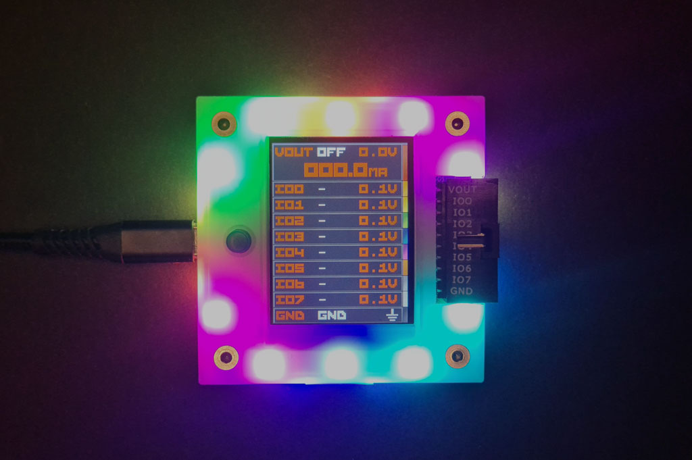

# Bus Pirate 5 Hardware Docs

 

Bus Pirate 5 is the latest edition of the original universal serial interface trusted by hackers since 2008. 

Can't get a chip to work? Is it the circuit, code, bad part or a burned out pin? The Bus Pirate sends commands over common serial protocols so you can get to know a chip before prototyping. Updated with tons of new features and tools, talking to chips and probing interfaces is more fun than ever!

## RP2040
- Based on Raspberry Pi Foundation RP2040
- 128Mbit flash storage for lots of features
- Firmware developed with the Pico C language SDK

## 8 Buffered IO pins
- 1.65-5volt operating range, 3 state
- Voltage measurement on every pin
- Toggleable 10K pull-up resistors
- 10 pin x 2.54mm main header
- 9 pin x 1.0mm auxiliary header

## Programmable Power Supply Unit
- Current Sense
- Programmable 1-5.0volt output
- Programmable 0-500mA current limit
- Resettable digital fuse
- Protection circuit

## 1Gbit NAND flash storage
- Save global and mode settings
- Appears as a USB disk drive
- Future use for logs, dumps and stand-alone programming

## LCD
- 320 x 240 pixel IPS all direction display
- Pin labels
- Live voltage measurements
- Live current consumption

## 18 RGB LEDs
- Introduction demo
- Party mode

## Just one button
- Escape from modes
- User input for production programming, remote hacking, whatever

## VT100 terminal interface
- Color interface
- Live update toolbar/monitor

## USB bootloader
- Updating is as simple as dragging a file onto the disk

## USB C connector
- ...but limited to the USB speeds supported by the RP2040

## Resources
import FooterDocs from '../_common/_footer/_footer-docs.md' 

<FooterDocs/>

## Join the fun

function MyComponent(){
    return (
        <a href="#" className="btn">  

        Get Bus Pirate 5 & Accessories

        <svg xmlns="http://www.w3.org/2000/svg" height="16" width="18" viewBox="0 0 576 512"><!--!Font Awesome Free 6.5.1 by @fontawesome - https://fontawesome.com License - https://fontawesome.com/license/free Copyright 2024 Fonticons, Inc.--><path d="M0 24C0 10.7 10.7 0 24 0H69.5c22 0 41.5 12.8 50.6 32h411c26.3 0 45.5 25 38.6 50.4l-41 152.3c-8.5 31.4-37 53.3-69.5 53.3H170.7l5.4 28.5c2.2 11.3 12.1 19.5 23.6 19.5H488c13.3 0 24 10.7 24 24s-10.7 24-24 24H199.7c-34.6 0-64.3-24.6-70.7-58.5L77.4 54.5c-.7-3.8-4-6.5-7.9-6.5H24C10.7 48 0 37.3 0 24zM128 464a48 48 0 1 1 96 0 48 48 0 1 1 -96 0zm336-48a48 48 0 1 1 0 96 48 48 0 1 1 0-96z"/></svg>   
        </a>
          
    );

}

### Get Bus Pirate 5
import FooterGet from '../_common/_footer/_footer-get.md' 

<button href="#" className="btn">

Get Bus Pirate 5 & Accessories
</button>

<MyComponent/>

<FooterGet/>

### Files
import FooterFiles from '../_common/_footer/_footer-files.md'

<FooterFiles/>

### Community
import FooterCommunity from '../_common/_footer/_footer-community.md'

<FooterCommunity/>

## FCC compliance statement
This device complies with part 15 of the FCC Rules. Operation is subject to the following two conditions: (1) this device may not cause harmful interference, and (2) this device must accept any interference received, including interference that may cause undesired operation.

## CE compliance
The Bus Pirate has been lab tested to comply with European CE requirements.

