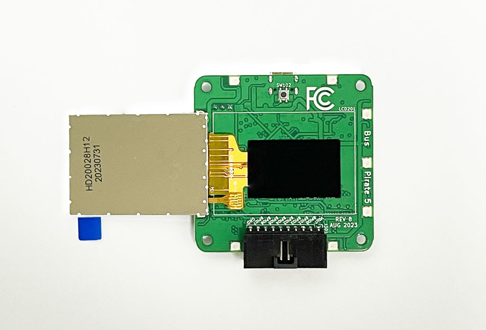
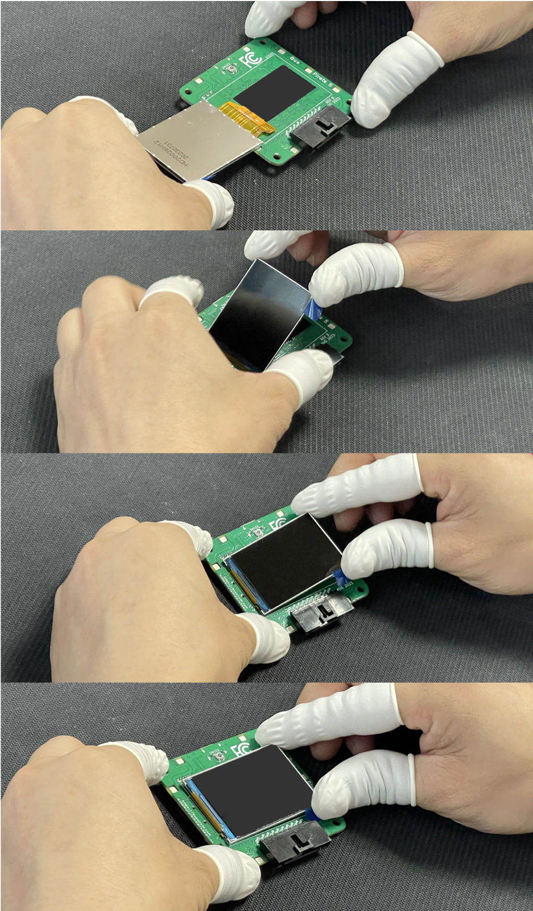

# Bus Pirate 5 Final Assembly

## Materials
|Quantity|Description|
|-|-|
|1|Tested Bus Pirate 5 PCB assembly|
|1|Enclosure|
|1|Button cap|
|4|M3x8mm DIN7991 bolts|
|2cm|Double-sided tape|

- Finger gloves to avoid smudging the LCDs

## Final assembly

### Finger gloves on!

### Tape LCD flex PCB

### Secure the LCD

:::info
Enclosure tooling is currently being made, we'll have the remaining steps in a few week!
:::

<!--

### Place board into enclosure base
:::info
Angle the board to slide the USB and programming connectors in place first. Now the board should sit flush with the bottom shell.
:::
### Remove LCD protector

### Place button cap into enclosure top

### Place base on the top

### Flip and secure with bolts
:::caution
Not too tight, don't crack the case or LCD.
:::
### Replace the LCD protector

-->

