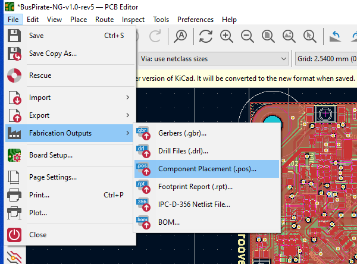
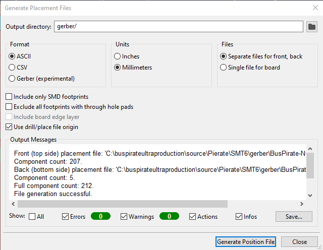
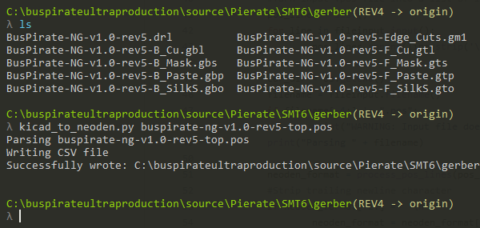
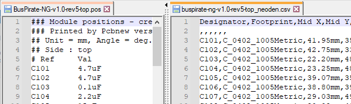

# Prepare Component Position File

import OldSiteWarning from '/old-site-warning.md'

<OldSiteWarning/>

## Generate Placement Files in KiCad

Open the Bus Pirate 5 project file in KiCad and open the PCB in the PCB editor.

In the PCB editor choose `File` > `Fabrication Outputs` > `Component Placement (.pos)`

## Save .pos files to ASCII format

Export in ASCII format and millimeters. Export seperate files for each side of the PCB, we'll just pick and place one side.

Click `Generate Position File`. **-top.pos** and **-bottom.pos** will be created and saved to the `/gerber` folder of the project.

## Convert to Neoden format .csv

Copy the [kicad_to_neoden.py](https://github.com/szczys/kicad_to_neoden) script to the `/gerber` folder containing the **.pos** files.

From a command prompt run `kicad_to_neoden.py {name of position file}` to convert the KiCad .pos files to Neoden friendly .csv format.

## Check the conversion

Open the new .csv file in a text editor to see the output.

According to the [KiCad-to-Neoden project page](https://github.com/szczys/kicad_to_neoden), the script makes the following changes to the data:
- Filters out all lines beginning with a hash (#)
- Converts 0-359 rotation value into -180 to +180 value
- Truncates measurements to two decimal places and adds "mm"
- Converts "top" to "T" and everything else to "B" (this could be a gotcha if there is anything other than "bottom" output by KiCad)
- Orders output for NeoDen to "Designator,Footprint,Mid X,Mid Y,Layer,Rotation,Comment"

