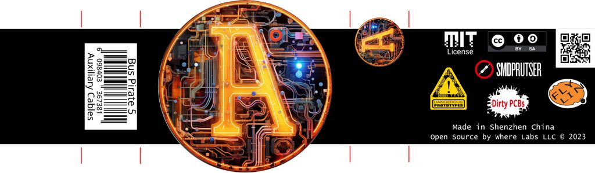

# Auxiliary Cables Package

## Contents
|Quantity|Cable|Length|Description|
|-|-|-|-|
|1|Logic analyzer cable|15cm|9pin 1.0mm to 9*1pin 2.54mm|
|2|Grey silicone Y splitter|15cm|1pin 2.54mm to 2*1pin 2.54mm|
|1|Red silicone Y splitter|15cm|1pin 2.54mm to 2*1pin 2.54mm|
|1|Black silicone Y splitter|15cm|1pin 2.54mm to 2*1pin 2.54mm|
|8|Grey silicone jumper|15cm|1pin 2.54mm to 1pin 2.54mm|
|1|Red silicone jumper|15cm|1pin 2.54mm to 1pin 2.54mm|
|1|Black silicone jumper|15cm|1pin 2.54mm to 1pin 2.54mm|

## Packaging

|Quantity|Item|Description|
|-|-|-|
|1|1cm Velcro cable tie|5cm|
|1|Zipper Bag|7x10cm|
|1|T Box|7x7x2cm (5.5x6.5x1.5cm inner)|
|1|Label Wrap|'A'|

- Wrap the AUX cables with 5cm of Velcro cable tie
- Place the cables in a bag
- Place the bags in a box
- Seal the box with a wrap label
- Shrink wrap the box

## EAN Number

|**EAN**|**Contents**|**Version**|
|-|-|-|
|6098403367381|Auxiliary Cables|REV0|
