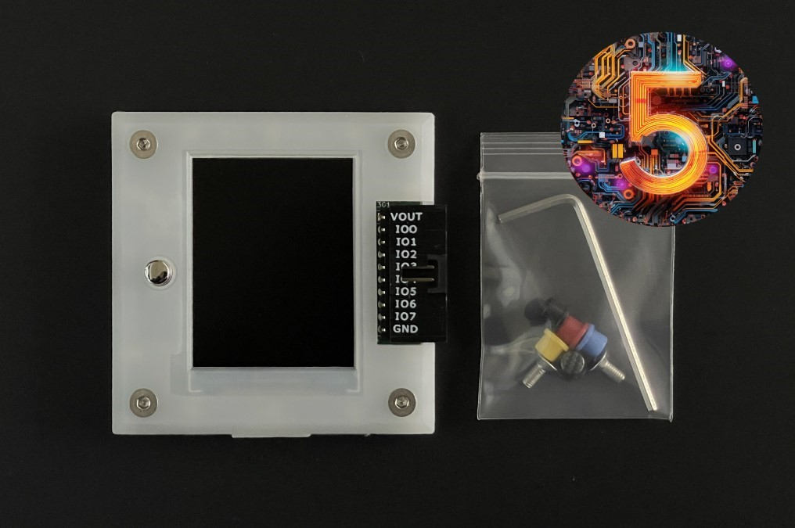
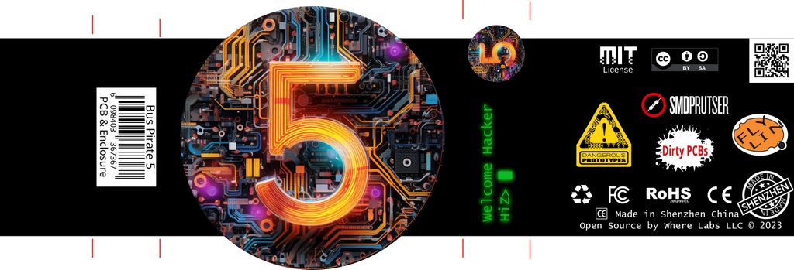

# Bus Pirate 5 Package

import OldSiteWarning from '/old-site-warning.md'

<OldSiteWarning/>

import FooterCart from '/_common/_footer/_footer-cart.md' 

<FooterCart/>

## Contents

|Quantity|Description|
|-|-|
|1|Bus Pirate 5 & enclosure|
|1|2mm HEX wrench|
|2|Extra DIN7991 bolts|
|5|Extra button caps|

## Packaging

|Quantity|Item|Description|
|-|-|-|
|1|Tear Bag with Window|9x13.5mm|
|1|Zipper Bag|4x6cm|
|1|T Box|9x9x2cm (7.5x8.5x1.5cm inner)|
|1|Label Wrap|'5'|

- Put the Bus Pirate in a tear bag
- Impulse seal the bag
- Place the 2mm HEX wrench, 5 extra button caps and 2 extra DIN7991 bolts in a zipper bag
- Place both bags in a box
- Wrap the label around the box
- Shrink wrap the box

## EAN Number

|**EAN**|**Contents**|**Version**|
|-|-|-|
|6098403367367|Bus Pirate 5 REV10 with enclosure|REV10|

## Get Bus Pirate 5
import FooterGet from '/_common/_footer/_footer-get.md' 

<FooterGet/>
