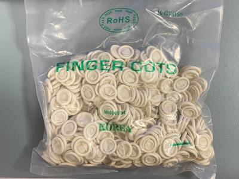
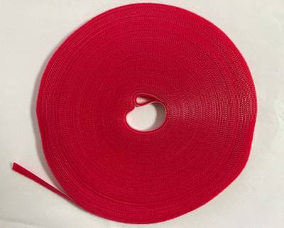
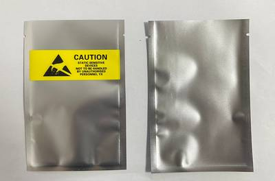
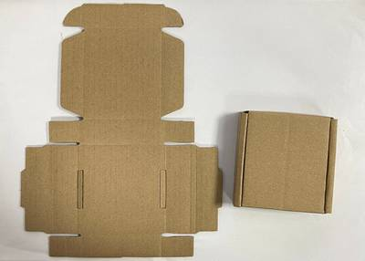
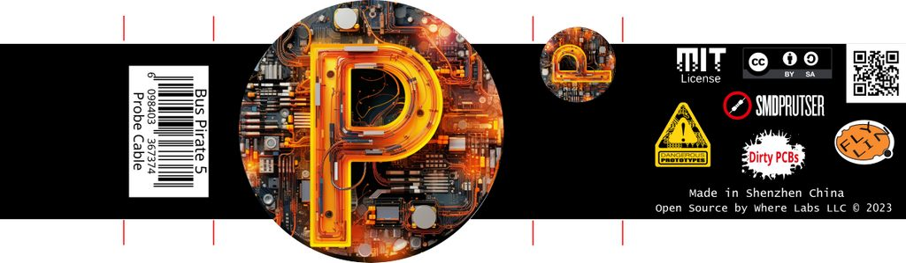
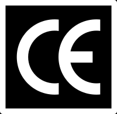

# Packaging Materials

import OldSiteWarning from '/old-site-warning.md'

<OldSiteWarning/>

## Finger Cots

To avoid fingerprints on the LCD and enclosure during assembly.

## Cable Tie

A 5cm strip of 1cm wide Velcro strap holds the auxiliary cables together. Out of a lot of options like custom bags, cable clips, and cable wraps, this was the easiest and cheapest.

## Antistatic Bags

|Product|Zipless Bag|Tear Bag with Window|
|-|-|-|
|Bus Pirate 5 (PCB and enclosure)|9x12cm |9x13.5mm|
|Bus Pirate 5 (PCB only)|8x10cm|8x13cm|

Bus Pirate 5 is impulse sealed in an antistatic bag. We chose to seal the bag instead of using a zipper bag because the zipper part of the bag is annoying to fold neatly into the packaging. We attempted to find something recycled or biodegradable, but there weren't any readily available options in the market.

Bags with a pre-cut tear-open notch and a clear front window are significantly more expensive (0.049RMB vs 0.15RMB), but have a nicer all around feel.

## Zipper Bags
|Product|Zipper Bag|
|-|-|
|Probe/Auxiliary Cables|7x10cm|
|Button caps, bolts and 2mm Hex Wrench|4x6cm|

Zipper bags for cables and small parts.

## Cardboard Boxes

|Product|T Box|
|-|-|
|Bus Pirate 5 (PCB & enclosure, PCB only)|9x9x2cm (7.5x8.5x1.5cm inner)|
|Probe/Auxiliary Cables|7x7x2cm (5.5x6.5x1.5cm inner)|

At sizes this small, the T box type has a lot more strength than a small box but doesn't have as much interior space.

## Label Wraps

Custom printed boxes are always tempting, but the MOQ is high and they take up a lot of storage room. Cheap box printing isn't always pretty, and if something is wrong or needs to be changed there's a lot of waste.

Our approach is to use large "waist" bands typically wrapped around bento box takeaway food. This type of printing is super fast, super cheap and a really refined product. Custom shapes are generally lasercut for low volumes, so tooling fees are mostly a thing of the past. The red lines just outside the artwork indicate where the waists will be pre-folded to fit our boxes.

|**Required Information**|**Explanation**|**Value**|
|-|-|-|
|Country of Origin Label|Many countries, USA for example, require the country of origin to be clearly marked on packaging|Made in China|
|EAN Number|An EAN (Europe, 13 digits) or SKU (USA, 12 digits) is required for sales in online retail giants, but is also helpful for all involved to track inventory. We purchased a block of EAN numbers from a bulk reseller.| See EAN table below|
|FCC Symbol|This symbol indicating FCC compliance certification is required for most electronic products sold in the United States. Some other countries also recognize the US FCC certification.||
|CE Symbol|This symbol indicating CE compliance certification is required for most electronic products sold in the European Union. Some other countries also recognize the EU CE certification.||
|RoHS indication|This symbol indicates RoHS compliance testing. Testing is required for most electronic products sold in the European Union. Some other countries also require RoHS compliance testing.||
|China Export Symbol|This symbol is easily confused with the CE symbol above, but it means China Export. It is a meme stamp among Chinese exporters and has no official registration or regulation.||
|Copyright statement||Where Labs LLC © 2024|

### EAN Numbers
|**EAN**|**Contents**|**Note**|
|-|-|-|
|6098403367367|Bus Pirate 5 REV10 with enclosure|Active|
|6098403367374|Probe Cable Kit REV0|Active|
|6098403367381|Auxiliary Cable Kit REV0|Active|
|TBD|Auxiliary Cable Kit REV1|Pending|
|6098403367398|Bus Pirate 5 REV8 (preview, PCB only)|EOL|

An EAN (Europe, 13 digits) or SKU (USA, 12 digits) is required for sales in online retail giants, but is also helps all involved to track inventory. We purchased a block of EAN numbers from a bulk reseller.

## Get Bus Pirate 5
import FooterGet from '/_common/_footer/_footer-get.md' 

<FooterGet/>
