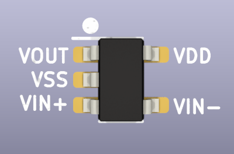
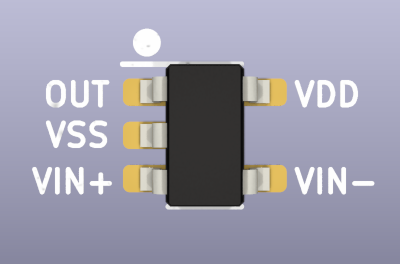

# Analog Components

import OldSiteWarning from '/old-site-warning.md'

<OldSiteWarning/>

:::info
**Bus Pirate 5 REV8 preview is no longer in production. [See the latest version](/).**
:::

## Op-amp rail to rail SOT-23-5

|**Reference**|**Package**|**Value**|**Quantity**|**Rating**|**Note**|
|-|-|-|-|-|-|
|U404, U601, U603|SOT-23-5|MCP6001 or GS6001 or RS6331  |3  |5 volts  |rail to rail  |

General purpose rail to rail op-amp with >1MHz GBP in SOT-23-5 package.

:::tip
We have also tested several cheaper domestic Chinese parts with the same specs and pinout. All seem to work well.
:::

Example:

*   [MCP6001T-I/OT](https://item.szlcsc.com/117744.html "MCP6001T-I/OT ") (Microchip) 
*   [GS6001 SOT-23-5](https://item.szlcsc.com/169048.html "GS6001 SOT-23-5 ") (Gainsil)
*   [RS6331XF](https://item.szlcsc.com/249404.html) (RUNIC)

## Comparator SOT-23-5

|**Reference**|**Package**|**Value**|**Quantity**|**Rating**|**Note**|
|-|-|-|-|-|-|
|U602  |SOT-23-5|RS8901XF or MCP6541  |1  |5 volts  | 

General purpose comparator in SOT-23-5 package. Microchip MCP6541, or any similar part.

:::tip
We tested RS8901XF in several revisions and it works well.
:::

Example:

*   [MCP6541T-I/OT](https://item.szlcsc.com/81989.html "MCP6541T-I/OT ") (Microchip)
*   [RS8901XF](https://item.szlcsc.com/249434.html "微功耗比较器RS8901XF ") (RUNIC)