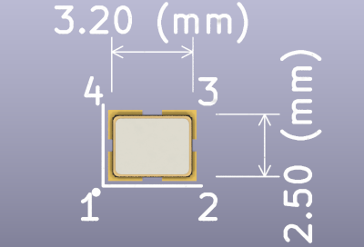

# Crystal

:::info
**Bus Pirate 5 REV8 preview is no longer in production. [See the latest version](/).**
:::

## Crystal 12MHz 18pf - 20pF, SMD3225-4 (4 pin)

|**Reference**|**Package**|**Value**|**Quantity**|**Rating**|**Note**|
|-|-|-|-|-|-|
|Y101|SMD3225-4|12MHz 18pf - 20pF  |1||<=+/-30ppm|

Any manufacturer crystal in 4 pin 3225 package. 18pF or 20pF, less than +/-30ppm frequency tolerance (we use +/-10ppm).

Example:

*   [X322512MSB4SI](https://item.szlcsc.com/9522.html)
