# Bus Pirate 5 Hardware Rev 8 

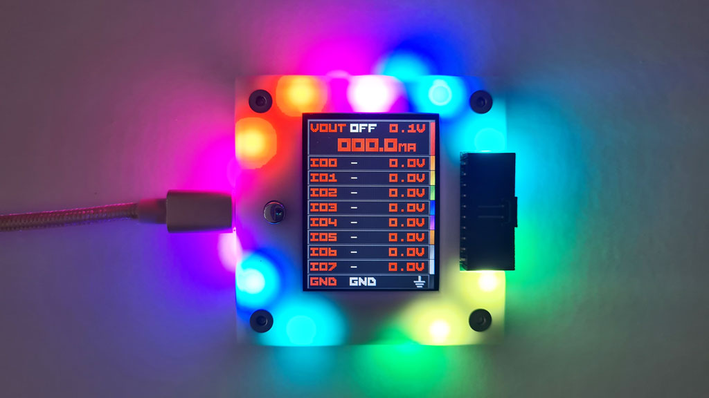

Bus Pirate 5 is an open-source hardware debugging tool designed to eliminate the frustrations and challenges commonly associated with hacking and hardware tinkering. We tried to tackle all the pain points, from bizarre and uncomfortable acrobatics with multimeter probes to the hassle of connecting multiple test hooks to a single pin. With Bus Pirate 5, information you need is right where you need it.

- **Bulldozer buffered IO** - 1.65 to 5volt direct interfacing with 8 bidirectional buffered IOs
- **Voltage measurement extravaganza** - Bus Pirate 5 displays voltage readings for every pin, right on its vibrant LCD screen and in the terminal statusbar
- **Current measurement** - Gain insights into the status of a device by monitoring current usage in real time
- **Programmable power supply** - 1 to 5volt output, 400mA max, for powering all kinds of devices
- **Programmable current limit** - A 0 to 500mA programmable hardware fuse sets current limits that keep your projects safe and sane
- **A big colorful display** - Keep track of pin assignments, voltages and current
- **Color terminal and statusbar** - VT100 terminal emulation for that modern 1970s feel
- **Just One Button** - A dedicated button for automating repetitive debug commands while you're wrist deep in circuits
- **Auxiliary Header** - A second header designed for easy connections to logic analyzers and other tools. No more struggling to fit multiple probe hooks on tiny chip leads

## Bus Pirate 5 vs Bus Pirate v3
||Bus Pirate 5|Bus Pirate v3|
|-|-|-|
|**Cores**|2x32-bits @ 125MHz RP2040/ARM|16-bits @ 16MHz PIC 24FJ64GA|
|**Flash**|128Mbits|512Kbits|
|**Magic peripheral**|RP2040 PIO module|PIC Peripheral Pin Select|
|**Terminal**|VT100 color with live statusbar|Monochrome ASCII|
|**LEDs**| 16 RGB LEDs|4 LEDs|
|**IO pins**| 8 IOs @ 1.65-5.0volts|5 IOs @ 3.3volts|
|**Pull-up resistors**| 8 pins|4 pins|
|**Voltage measurement**|All pins| 1 ADC probe|
|**Power supply**|1-5volts| 3.3volts, 5volts|
|**Current sense**|0-500mA|-|
|**Programmable fuse**|0-500mA|-|
|**Display**| 320x240 IPS all-angle|-|
|**TF flash card storage**| up to 64GB| -|

<div class="img-center">

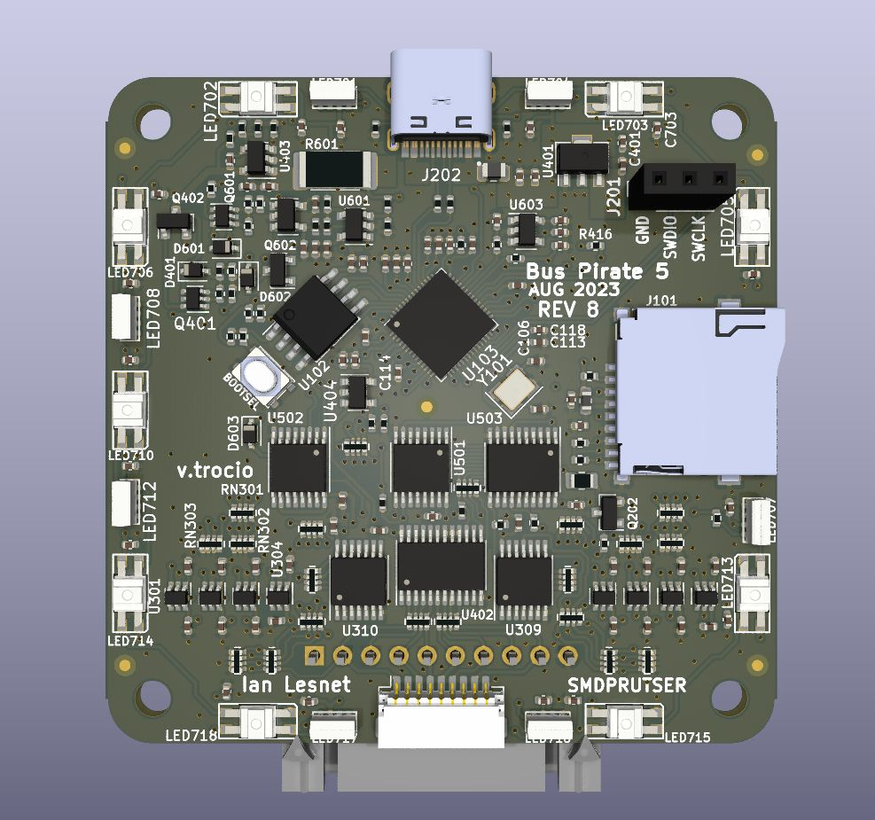

</div>

## RP2040

[](./img/bp5rev8/BusPirate-5-rev8.pdf)

It's like the RP2040 was designed for a Bus Pirate. Two ARM cores, cheap external flash storage and the 4 PIO modules are true hardware interface to just about any esoteric protocol. No more bit-banged software libraries!

The [RP2040](../rev8/components/chips#microcontroller-rp2040-qfn-56) (U103) has a built-in bootloader that appears as a USB disk drive - just drag a firmware file into the drive to update the Bus Pirate. The bootloader is locked in ROM, there's no chance of accidentally erasing or corrupting it. What a happy little chip!

We paired the RP2040 with a [128Mbit flash chip](../rev8/components/chips#flash-128mbit-spi-soic8-208mil) (U102), the maximum supported. There should be plenty of room to add features for years to come. All that space has already paid off with features like multi-language support in a single firmware release.

### Output Expander

[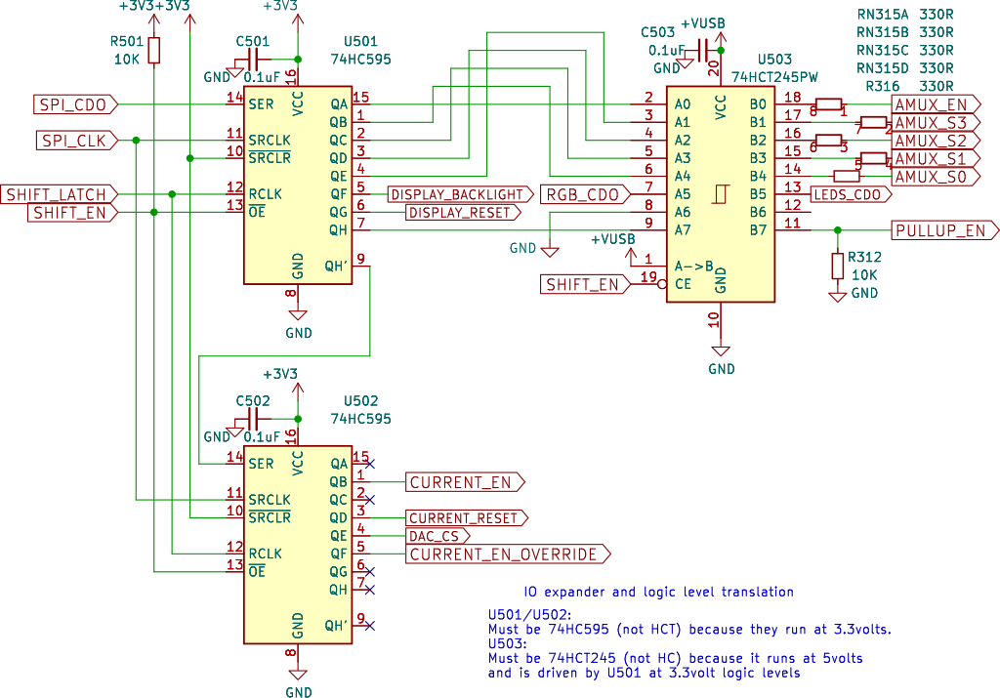](./img/bp5rev8/BusPirate-5-rev8.pdf)

While the RP2040 is an amazing chip that's fun to work with, we struggled with the low pin count. Two [74HC595 shift registers](../rev8/components/chips#74hc595-shift-register-tssop-16) (U501/U502) unartfully clamped to a shared SPI bus give an extra 16 outputs to control hardware on the board. Currently these pins control the LCD backlight, toggle options in the programmable power supply unit, enable pull-up resistors and select channels on the analog multiplexer - slow tasks that lend themselves to serial to parallel output.

One 74HC595 is connected to a [74HCT245 level shifter](../rev8/components/chips#74hct245-bus-transceiver-tssop-20) (U503) that translates 3.3volt output to 5volts/VUSB. This gives some flexibility to choose 74HC or 74HCT parts, depending on what is actually available and cheapest in the market. Part selection has been especially important as supply chain issues have delayed production for over a year.

:::tip
Some control signals are translated to 5volts so we can fit a 74HC(T)4066 and 74HC(T)4067 depending what is available. The supply of 7400 logic chips remains uncomfortably weird.
:::

### ADC Expander

[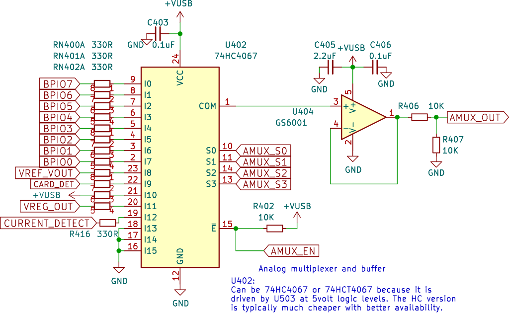](./img/bp5rev8/BusPirate-5-rev8.pdf)

Live voltage measurement on every pin was an absolute feature requirement for Bus Pirate 5. We want to to see whats happening at a glance, not perform bizarre and uncomfortable acrobatics with multimeter probes. 

The RP2040 only has 4 analog to digital converter inputs, so we tossed on a 16 channel [74HC4067 analog mux](../rev8/components/chips#74hct4067-analog-mux-tssop-24) (U402). The mux connects the IO pins, the programmable power supply and various test points to a single RP2040 ADC pin. 

To avoid interfering with digital signals while measuring them, the mux output is buffered by an [op-amp](../rev8/components/analog#op-amp-rail-to-rail-sot-23-5) (U404) before being divided by 2 with a pair of [10K resistors](../rev8/components/passives#resistors-1-0402) (R406/R407). All those 330R series input resistors are intended to limit back powering to tolerable levels.

:::info
Due to a lack of inputs on the RP2040, TF flash card detect and over current detect are digital signals measured through the analog mux.
:::

## 8 IO Units

[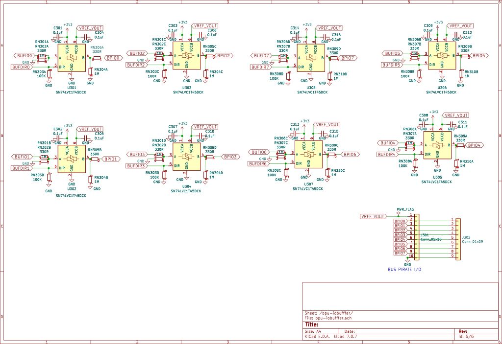](./img/bp5rev8/BusPirate-5-rev8.pdf)

### 1.65-5volt Buffers

[](./img/bp5rev8/BusPirate-5-rev8.pdf)

IO pins are fitted with [74LVC1T45 bidirectional buffers](../rev8/components/chips#74lvc1t45-bi-directional-buffer-sc70-6sot363), we call this chip 'the bulldozer'. Half of the buffer is powered at 3.3volts to interface the RP2040. The other half is powered from the VREF/VOUT pin at 1.65-5volts to interface with the outside world. 74LVC1T45 has great specs for hacking, like 5.5volt tolerant pins and a feature that disables everything when either half of the buffer is unpowered.

Two RP2040 pins control each buffer: one sets the direction (input/output), and one does the actual IO (high/low/read). In the past this setup forced us towards a CPLD or FPGA to deal with bidirectional protocols like I2C, but the RP2040 PIO peripheral does a great job of managing the buffer.

:::caution
Care must be taken so the buffer and RP2040 don't draw excessive current from each other. This happens when both pins are set to output at the same time, one high and one low. To prevent damage we limit the maximum current draw with 330R series resistors on each 74LVC1T45 IO pin.
:::

|Part Number|Manufacturer|Voltage Range|
|-|-|-|
|SN74LVC1T45|Texas Instruments|1.65-5.5volts|
|74LVC1T45|Diodes INC|1.65-5.5volts|
|74LVC1T45|Nexperia|1.2-5.5volts|

At least three manufacturers make a 74LVC1T45 with slightly different specifications. They perform similarly, but the Nexperia part has a wider voltage range.

|Hardware Revision|Buffer Chip|
|-|-|
|REV8| Texas Instruments|

Current hardware is fitted with buffers made by Texas Instruments. For the past two years it was the only part that's been available, and for six months even the TI part was hard to find. In the future we'd like to switch to the Nexperia part for the wider operating range, or the Diodes INC part because it's significantly cheaper than the others. 

### Toggleable Pull-up Resistors

[](./img/bp5rev8/BusPirate-5-rev8.pdf)

Each IO pin has a toggleable [10K pull-up resistor](../rev8/components/passives#resistor-arrays-5-0402x4-convex). Onboard pull-ups are controlled by two [74HC4066 analog switches](../rev8/components/chips#74hct4066-analog-switch-tssop-14) (U309/U310), and powered through the VOUT/VREF pin.

### Main IO Connector

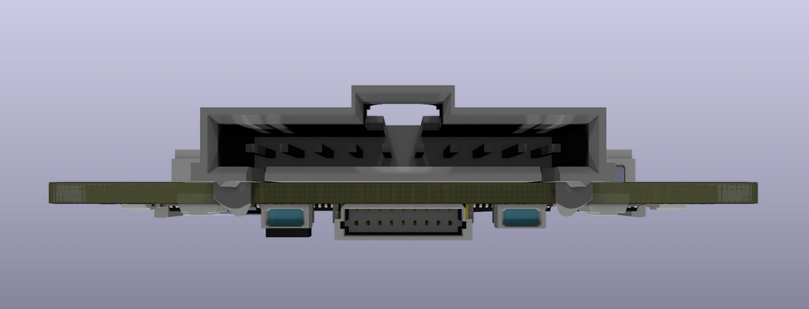

Bus Pirate 5's main IO header uses a 2.54mm 10 pin [TJC8A/HX25418 connector](../rev8/components/connectors#10p-male-254mm-right-angle-90-degrees-shrouded-connector) (J301). This is a keyed locking connector that works just as well with common jumper wires and 2.54mm 'DuPont' style connectors.

|Pin|Label|Description|
|-|-|-|
|1|VOUT/VREF|Pin supplies 1-5volts up to 400mA with current limit and resetable fuse (VOUT) **OR** connects an external voltage source to the Bus Pirate IO interface (VREF)|
|2-9|IO0 - IO7|Buffered 1.65-5volt IO pins with voltage measurement and optional 10K pull-up resistors|
|10|GND| Ground pin|

:::info
The pinout is logical! VOUT/VREF, IO0-IO7 and Ground. Bus Pirate v3 tried so very hard to have a logical pinout, but a mis-rotated IDC connector grandfathered in a confusing pin order for nearly 15 years. 
:::

### Auxiliary IO Connector


A secondary [1mm 9 pin connector](connectors#9p-male-10mm-right-angle-90-degrees-jst-sh-compatible-connector) (J302) under the main IO header is intended as a tap point for a logic analyzer. No need to balance two or three probes on a single tiny chip lead, access the bus activity from this secondary header.

|Pin|Label|Description|
|-|-|-|
|1-8|IO0 - IO7|Buffered IO pins with voltage measurement and optional 10K pull-up resistors|
|9|GND| Ground pin|

:::tip
The 1mm 9 pin connector mates with 'SH' style cables.
:::

## Programmable Power Supply Unit

[](./img/bp5rev8/BusPirate-5-rev8.pdf)

The bulldozer IO buffers run from 1.65 to 5volts, they need a power supply to match. The programmable power supply unit is another killer feature of Bus Pirate 5. 
- 1-5volts adjustable output, 400mA max
- 0-500mA current sense 
- 0-500mA current limit with digital fuse
- Backflow prevention to protect the PPSU when an external voltage is applied to the VREF/VOUT pin

### Adjustable Output 1 to 5volts

[](./img/bp5rev8/BusPirate-5-rev8.pdf)

The heart of the programmable power supply is a 0.8 to 5volt [adjustable output voltage regulator](../rev8/components/voltage-regulators#adjustable-ldo-vreg-with-08v-to-50v-output-sot-23-5) (U403). Normally fixed resistor values set the output voltage of an adjustable regulator, but we've given it programmable output [by margining](https://e2e.ti.com/blogs_/archives/b/precisionhub/posts/give-your-voltage-regulator-the-margin-it-deserves) the feedback pin with an RP2040 pulse width modulator. The PWM output of the RP2040 is filtered through a 10K resistor (R414) and 100nF capacitor (C415), then buffered with an op-amp (U603).

Older adjustable voltage regulators typically have a range from 1.25 to 5volts or more. A newer class of regulators go a bit lower - down to 0.8volts. 

We worked with two regulators during development: MCP1824 from Microchip, and AP2127 from Diodes INC. They have the same pinout and similar specs, but the MCP1824 has a 0.41volt reference while the AP2127 has a 0.8volt reference. We prefer the MCP1824 because the reference value makes it easier to select common resistors for the margining circuit, but it has become expensive and at times hard to find.

:::warning
400mA is the rated maximum of the voltage regulator, but we added some headroom in the current limit circuit to account for current spikes.
:::

|**Part**  |**Ideal Value**|||**Closest Value**|
|-|-|-|-|-|-|-|
||R403|R404|R405|R403|R404|R405|
|**MCP1824**|77.96K|99.22K|10K|78K|100K|10K|
|**AP2127**|103.13K|131.25K|33K|102K|133K|33K|

MCP1824 and AP2127 are similar, but each has a different reference voltage. R403/R404/R405 need to match the regulator as shown in the table.

:::tip
A common 1.25V-5V adjustable regulator can be used with the correct resistor values (see calculations spreadsheet). The Bus Pirate will lose features though. The output range will be limited to 1.25volts to 5volts, instead of ~1volts to 5volts.
:::

### Current Sense

[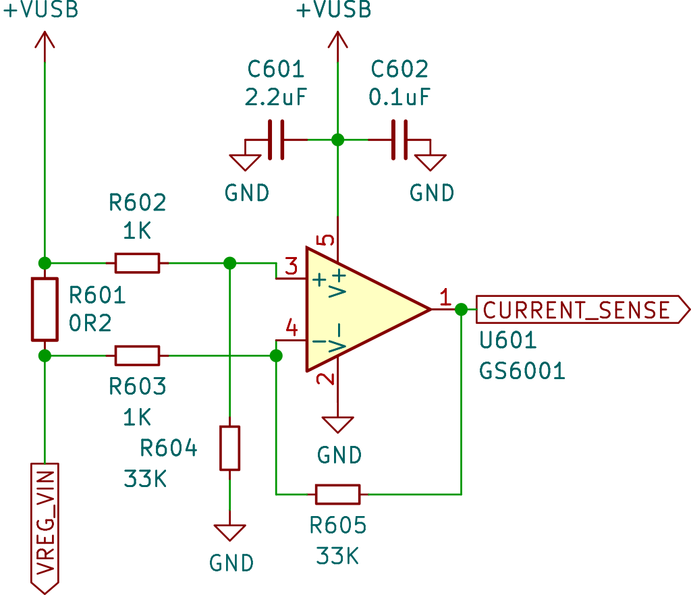](./img/bp5rev8/BusPirate-5-rev8.pdf)

Current consumption can be used as a proxy to debug a circuit. Is there a short? Is this chip even running? This is certainly evident in the Shenzhen mobile phone repair markets where current meters taped into cardboard boxes are the go-to tool for diagnosing iPhone motherboard failures. 

A [200m resistor](../rev8/components/passives#resistor-02r-1-2w-2512) (R601) causes a slight voltage drop in proportion to the current passing through it. [An op-amp](../rev8/components/analog#op-amp-rail-to-rail-sot-23-5) (U601) amplifies the difference approximately 32 times, scaling 0-500mA current use to a 0-3.3volt output we can measure with the RP2040 ADC. 

:::info
Current sense is measured with a dedicated RP2040 ADC instead of passing through the analog multiplexer. This is because the mux is followed by a voltage divider that would cut the measurement resolution in half. That wouldn't be fair to our hard working little op-amp!
:::

### Programmable 0-500mA Current Limit

[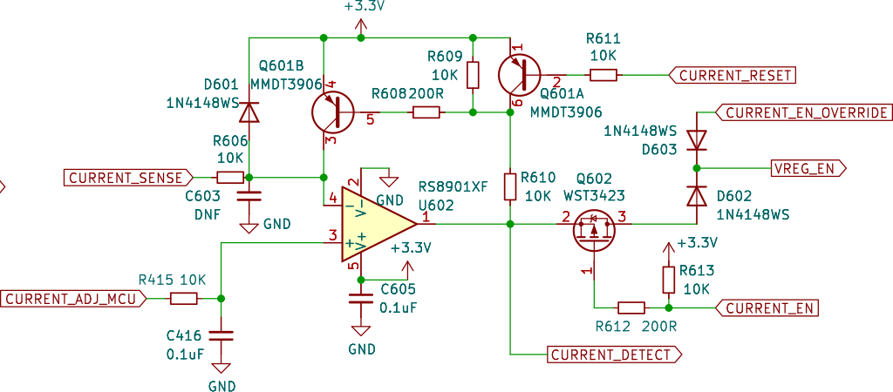](./img/bp5rev8/BusPirate-5-rev8.pdf)

Since we've already got current consumption scaled to a 0-3.3volt output signal, wouldn't it be cheeky to pop a comparator behind it to make a programmable fuse? 

The scaled current sense output hits [the comparator](../rev8/components/analog#comparator-sot-23-5) (U602) on the ```-``` pin. The limit is set with another filtered (R415/C416) pulse width modulator output to the comparator ```+``` pin. When the current sense voltage on the ```-``` pin exceeds the limit set by the PWM on the ```+``` pin, the output inverts to shut down the voltage regulator. 

This doesn't quite get us there though. When the voltage regulator shuts down current use will drop, causing the comparator to flip back on. This creates a loop in which the VREG oscillates on and off. That's definitely not what we want.

A [PNP transistor pair](../rev8/components/transistors-fets#dual-pnp-transistor-general-purpose-sot-363sc-70-6) (Q601A/B) and a few [passive parts](../rev8/components/passives) capture the inversion and hold the comparator in the off state. The PNP pair sustains a current path through the two transistors until it is forcibly changed by an outside voltage (CURRENT_RESET). 

A [PFET](../rev8/components/transistors-fets#pmos-fet-2a-vgs-2-volts-sot-23) (Q602) controlled by a 74HC595 pin enables the comparator output to switch the voltage regulator. Two [diodes](../rev8/components/passives#diode-1n4148-sod-323) (D602/D603) create logical OR with another 74HC595 pin so the system can be overridden completely.

There you have it, a programmable fuse with just a couple extra parts. 

:::warning
400mA is the rated maximum of the voltage regulator, but we added some headroom in the current limit circuit to account for current spikes.
:::

### Backflow Prevention

[](./img/bp5rev8/BusPirate-5-rev8.pdf)

A [backflow prevention switch](https://www.electro-tech-online.com/articles/simple-inexpensive-ideal-diode-mosfet-circuits.817/) helps protect all the little analog bits when an external voltage is applied to the VOUT/VREF pin. A [closely matched PNP pair](../rev8/components/transistors-fets#dual-pnp-transistor-matched-pair-sot-363sc-70-6) (Q401A/B) creates a current mirror that controls a [P-channel MOSFET](../rev8/components/transistors-fets#pmos-fet-2a-vgs-2-volts-sot-23) (Q402) high-side switch. When the voltage on VREF/VOUT is greater than the voltage in the PPSU, the PFET turns off. 

The Bus Pirate monitors voltages on both sides of the PFET to detect when it deactivates and display a warning.

|**Symbol**|**Parameter**|**Conditions**|**Min**|**Typ**|**Max**|**Unit**|
|-|-|-|-|-|-|-|
|hFE1/hFE2|hFE matching|VCE=-5V; IC=-2mA|0.9|1|-|-|
|VBE1-VBE2|VBE matching|VCE=-5V; IC=-2mA|-|-|2|mV|

Q401 requires a closely matched PNP transistor pair. The hFE of the transistor pair should differ by no more than 10%, and the VBE should differ no more than 2mV.

:::info
While the adjustable voltage regulator is capable of 0.8 to 5.0volt output, the Vgs threshold of the PFET determines the minimum output. Common inexpensive PFETs generally have a -1volt Vgs (maximum) rating, and therefore may not fully turn on in the 0.8-1volt range.
:::

:::tip
R408/R409 are two 33K resistors instead of a single resistor. This was done to reduce the number of parts in the BOM and save a pick and place feeder during development.
:::

## TF flash card Socket

[](./img/bp5rev8/BusPirate-5-rev8.pdf)

A [TF flash card socket](../rev8/components/connectors#micro-sd-card-socket) is connected to the RP2040 via an SPI bus shared with the LCD and 74HC595 IO expanders. A [22uH inductor](../rev8/components/passives#inductor-22uh-50ma-0603) (L100) helps prevent brown out resets caused by inrush current when a card is inserted. 

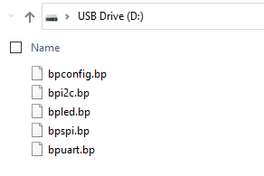

TF flash card storage is used to save global and mode configuration preferences in simple JSON files. It can also be used for all kinds of interesting things, like firmware storage for production programming, saving dumps from flash chips and EEPROMs or logging bus communications. It will be interesting to see what the community comes up with.

:::info
The TF flash card appears as a readable and writable USB disk drive, however the speed is very low because there aren't enough RP2040 pins to implement a full TF flash card interface.
:::

## LCD

[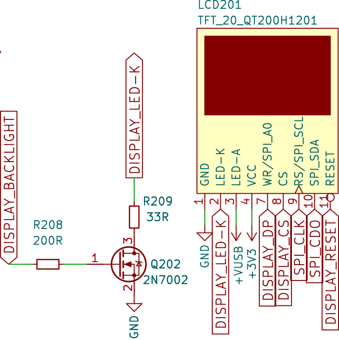](./img/bp5rev8/BusPirate-5-rev8.pdf)

A beautiful 240x320 pixel color [IPS (all angle viewing) LCD](../rev8/components/leds#lcd-20-ips-lcd-240x320-st7789v-with-spi-interface-qt200h1201) acts as a pin label, displays the voltage on each pin and shows the current used by the programmable power supply unit. The LCD shares an SPI bus with the TF flash card and 74HC595 IO expanders. The display is already FCC certified, which doesn't exempt us from certification, but a bad LCD can spray radiation all over the spectrum causing us to fail.

The display is happy working at the maximum possible SPI speed of the RP2040. Unfortunately, TF flash cards become misconfigured when SPI is run above 32MHz so we have to settle for half speed. A lot of the limitations we encountered in this design result from the very low pin count of the RP2040. With an additional 16 or 32 pins, each SPI peripheral could sit on a separate bus and life on the board would be much happier.

:::info
The background image is a bitmap converted to a C byte array and included in the firmware. Several open source font sets were converted to bitmaps to power the display.
:::

## 16 RGB LEDs

[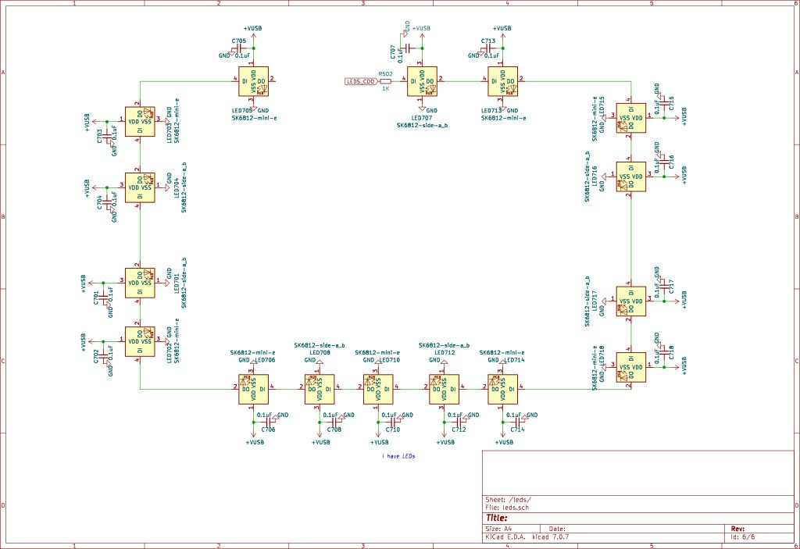](./img/bp5rev8/BusPirate-5-rev8.pdf)

It's customary to have an indicator LED, so to check that box we added 16 [SK6812 RGB LEDs](../rev8/components/leds#led-sk6812-mini-e-led6028--3528). SK6812s are controlled by a time-based protocol over a single wire, which is normally a real pain to work with, but the RP2040's PIO module makes it a breeze. The LEDs are powered directly from USB voltage (~5volts), and require a 5volt input signal. The RP2040's 3.3volt output is converted to 5volts using one pin of the 74HCT245 level shifter.

SK6812s are found in cheap LED strips, so they're common, inexpensive and come in a variety of interesting form factors. 9 [MINI-E packaged LEDs](../rev8/components/leds#led-sk6812-mini-e-led6028--3528) shine up through holes in the PCB to illuminate the case around the LCD. 7 [SIDE-A LEDs](../rev8/components/leds#led-sk6812-side-a-4020--40x20x16mm) along the edge of the board give an under lighting effect. 

:::tip
There are two common footprints for SK6812-SIDE-A. The preferred part has evenly spaced pads that bend 90 degrees and extend up the back of the case. We have had the best success reflow soldering this footprint, and it is MUCH easier to hand rework than others.
:::

You might be thinking, 16 LEDs x 3 colors x 20mA is too much current for USB! You'd be totally right! Great care is taken in the firmware to ensure that the maximum current stays within the allowable limits for USB. 

:::warning
If you go hardware hacking, be aware that it is possible to far exceed the limits of your USB port when the LEDs are turned on at 100% brightness. It does look really cool though.
:::

## Just One Button

<div class="img-center">


</div>

16 party LEDs, but just [one button](../rev8/components/switches#spst-33x33mm-15mmh)! The button is intended to automate repetitive tasks, such a production programming of firmware. It's also there to help escape from modes where the Bus Pirate would otherwise need to be unplugged and plugged in again, such as a transparent UART bridge.

:::info
Previous revisions had three buttons (up/ok/down) to control a menu on the LCD. However, those revisions used a DAC chip to set the voltage and current of the programmable power supply unit. This DAC was a casualty of the supply chain crisis so we re-rolled the board to use RP2040 PWMs instead. This change gobbled up the button pins, though we managed to reclaim one by detecting over current through the analog mux instead of an RP2040 interrupt pin.
:::

## VT100 Terminal

<div class="img-center"> 

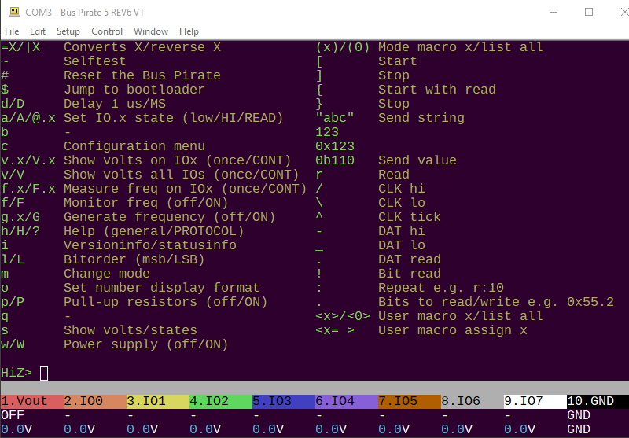 

</div>

Bus Pirate 5 is used through a serial terminal. The optional VT100 mode supports color and a live statusbar view of the function and voltage on each pin, such as frequency generation and measurement. If an TF flash card is inserted, the Bus Pirate will save your terminal preferences for the next session.

## Other Documentation
Bus Pirate 5 documentation is broken into [hardware](https://hardware.buspirate.com/introduction) and [firmware](https://firmware.buspirate.com/introduction) sections so it can be versioned easily with each update. Here's some other fun stuff you might enjoy.
- [Component selection and sourcing](../rev8/components/introduction)
- [Case/enclosure](enclosure/fdm-shell)
- [Cables](https://firmware.buspirate.com/overview/cables)
- [Milled breadboard pins](https://firmware.buspirate.com/overview/milled-breadboard-pins)
- [Hardware users guide](https://firmware.buspirate.com/overview/hardware)
- [Firmware tutorials](https://firmware.buspirate.com/tutorial-basics/quick-setup)
- [Command reference](https://firmware.buspirate.com/command-reference/all-commands)
- [Firmware development](development/code) and [translation](development/translation)
- [Manufacturing resources](category/manufacturing)

## Interactive BOM

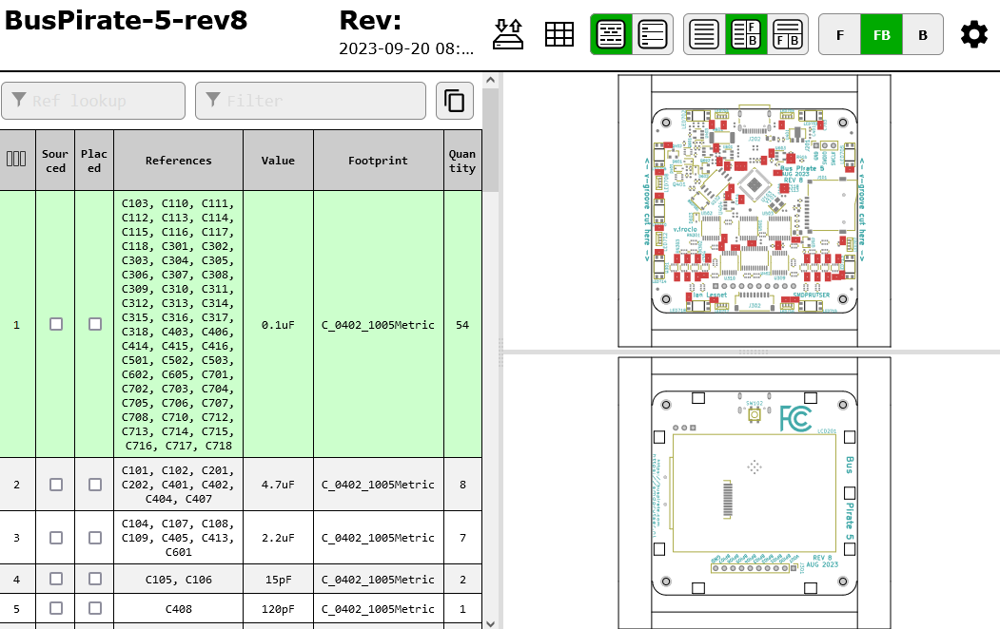

[Bus Pirate 5 REV8 interactive BOM](pathname:///bp5-rev8-bom.html). Created with [Interactive HTML BOM plugin](https://github.com/openscopeproject/InteractiveHtmlBom) for [KiCad](https://www.kicad.org/).


## Join the fun
### Get Bus Pirate 5
- [Bus Pirate 5 assembled PCB preview release](https://dirtypcbs.com/store/designer/details/ian/6621/bus-pirate-5-preview-version-pcb-only)
- [Bus Pirate Premium Probe Cable](https://dirtypcbs.com/store/designer/details/ian/6619/bus-pirate-5-probe-cable-kit)
- [Bus Pirate Premium Auxiliary Cables](https://dirtypcbs.com/store/designer/details/ian/6620/auxilary-cable-kit)
- Bus Pirate 5 and enclosure (coming soon!)

### Files
- [Bus Pirate 5 hardware repository](https://github.com/DangerousPrototypes/BusPirate5-hardware)
- [Bus Pirate 5 firmware repository](https://github.com/DangerousPrototypes/BusPirate5-firmware)

### Community
- [Forum](https://forum.buspirate.com)
- [Blog](https://buspirate.com/) and mailing list
- [Mastodon](https://mastodon.social/@buspirate)
- [BlueSky](https://bsky.app/profile/buspirate.bsky.social)
- [Twitter](https://twitter.com/dangerousproto)

