# RP2350: Bus Pirate 5XL and 6

import OldSiteWarning from '/old-site-warning.md'

<OldSiteWarning/>

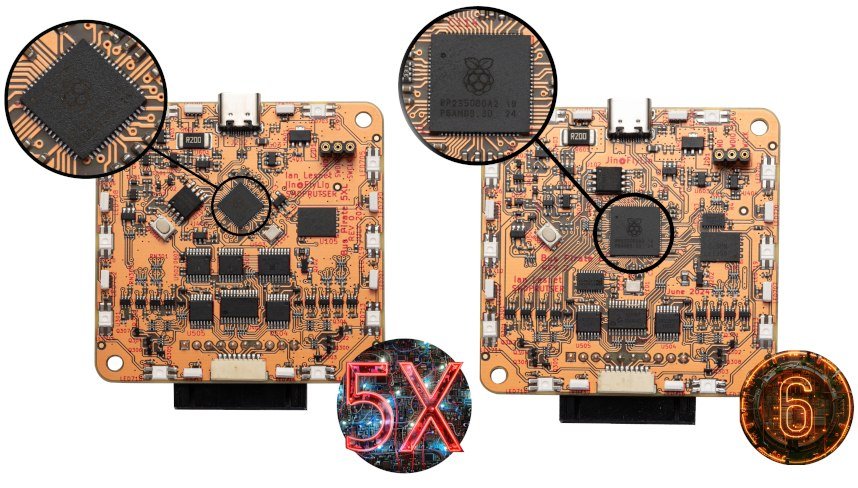

Raspberry Pi has two new chips out – RP2350A and RP2350B. Some quick stats:
- 2 x ARM M33 cores at 150MHz
- 2 x RISCV Hazard 3 cores (up to 2 cores at once, mix and match)
- 520K RAM (vs 264K on RP2040)
- 3 PIO modules (vs 2 on RP2040)
- Hardware floating point unit
- MUCH improved ADC
- More pins!
- A new bootrom that should make it a lot easier to load multiple programs into a single firmware file
- Some one-time programmable memory to customize the UF2 bootloader drive, among other things
- A bunch of security stuff

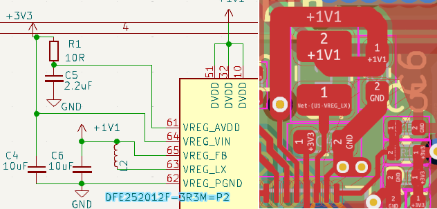

The on-chip core supply LDO is replaced with a switch mode power supply. It requires a specific expensive inductor that costs more than a TI branded 1.1volt LDO though. The SMPS uses 5 pins on each package so it's not a drop in replacement for the RP2040.

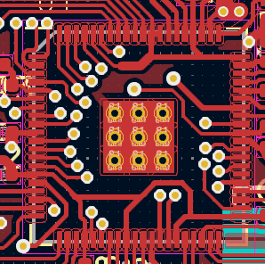

Pin functions and modules like SPI/I2C/PWM are on the same pins as the RP2040, so GPIO0-29 have all the same functions. All ground pins have been eliminated, the only grounding is now through the center pad.

## RP2350A

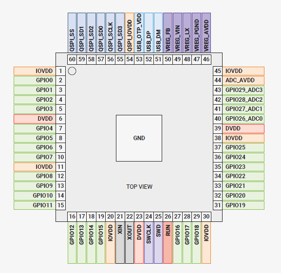

RP2350A has the same 30 GPIOs as the RP2040, but because of the SMPS it has larger 60 pin package. It is not a drop in replacement, but the pinout is similar.

## RP2350B

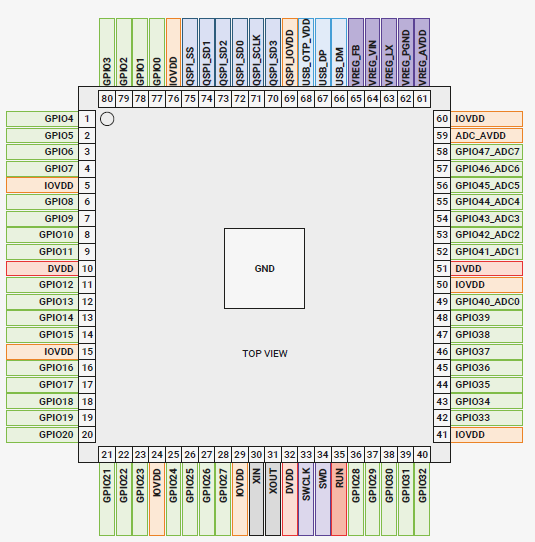

RP2350B has an additional 18 GPIO pins, as well as some extra PWM units on the new pins. It comes in an 80 pin package.

## PICO SDK 2.0

One nice update to the SDK is a function to search or a free PIO and SM with enough free space for a program. We've talked about rolling this ourselves in the past, but they've provided it. Now is probably the time to port over @phdussud 's PIO based frequency measurement.

## Bus Pirate 5XL

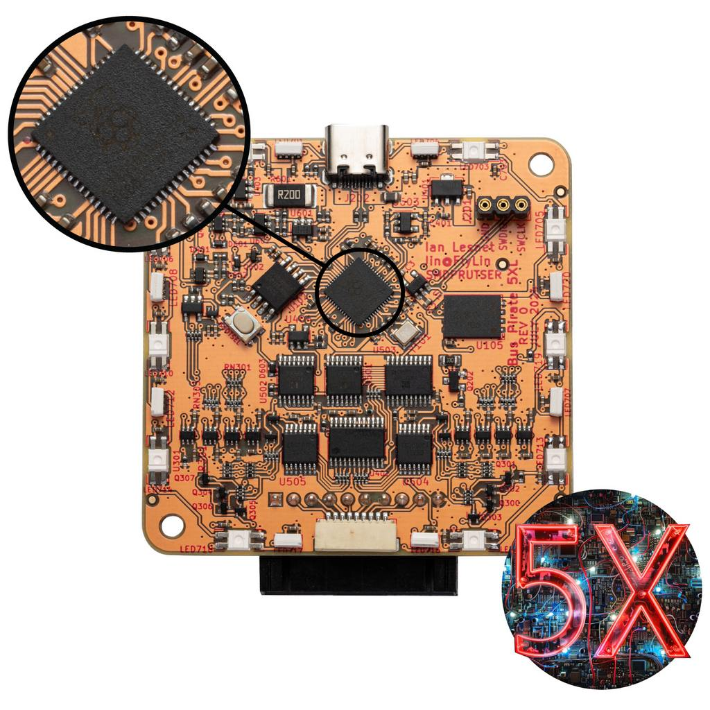

5XL uses the RP2350**A** with upgraded RAM and newer ARM cores, but it's otherwise the same board as 5.

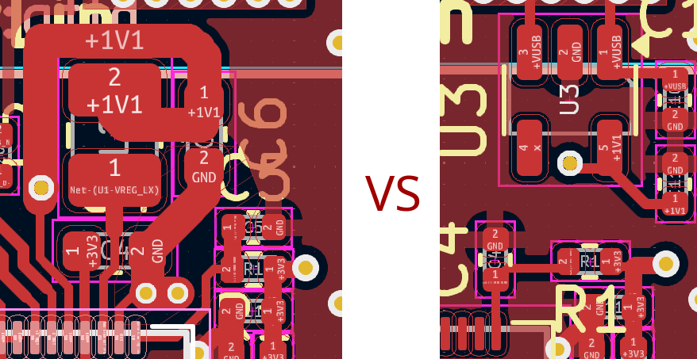

We made two versions of 5XL. One used the on-chip SMPS to power the core, and one used a cheap 1.1volt LDO regulator from TI. Rpi was really adamant about the layout for the SMPS, so I worried we wouldn’t get it right or get it through FCC/CE certification. Both boards worked, but in the end the LDO was an easier choice:

- Half the parts cost of the SMPS
- Only one additional BOM item (vs 2 with SMPS)
- Takes less room at a critical place on our existing PCB
- Presumably less worries about passing certification

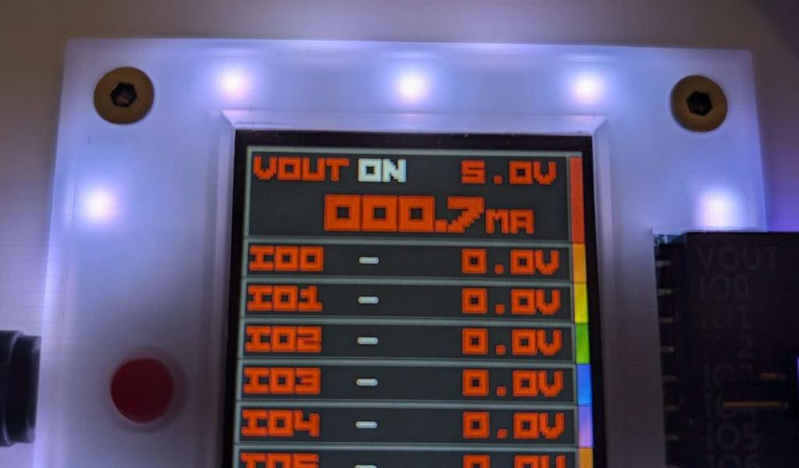

The upgraded (or fixed, if you prefer) ADC is a lot better. This is especially noticeable in the current sense measurement which no longer jumps around and is way more accurate.

## Bus Pirate 6

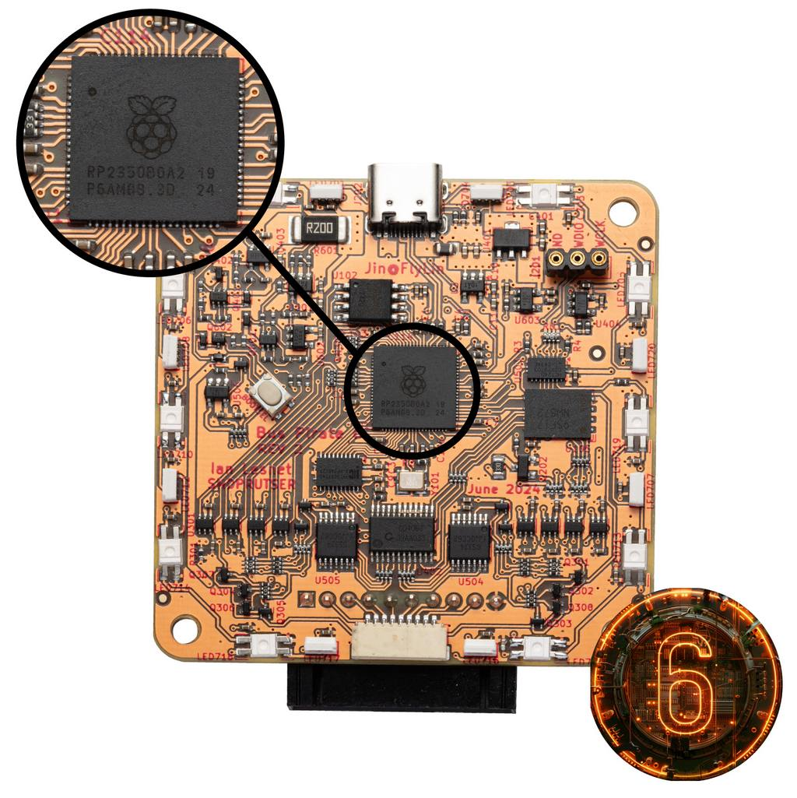

Bus Pirate 6 uses the RP2350**B** with 18 additional IO pins. More pins = more fun.

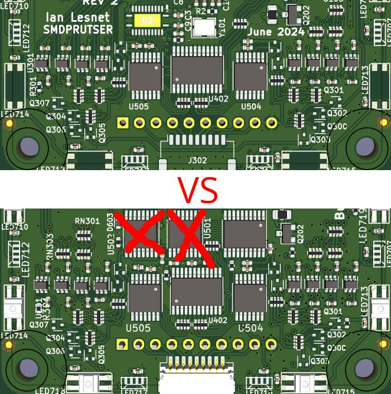

First, we got rid of the 74HC595 IO expanders. Everything on the board is directly controlled by the RP2350B. Some huge advantages here:

- Faster. No longer using SPI to change analog mux channels, enable pull-ups and configure the programmable power supply. That also means less traffic on the SPI bus shared with the NAND flash and LCD. The SPI traces are extremely short and tight now, so we might even be able to run at a higher speed (yet to be seen).
- More space. The Bus Pirate PCB is extremely crowded, we just removed two “huge” TSSOP chips.

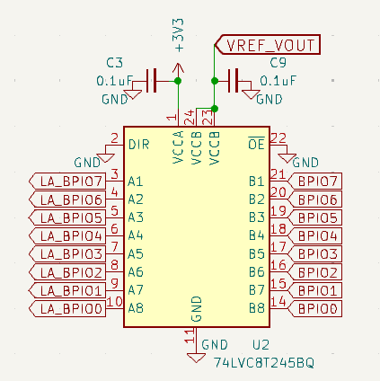

Second, we finally achieved the long term goal of adding a **“follow along” logic analyzer**. A 74LVC8T245 buffer connects 8 of the new GPIOs to the 8 Bus Pirate IO pins. Now the Bus Pirate can automatically record what happens on the bus every time a command is sent. Software support is still needed, but I expect this will be a super useful learning and debugging tool.

Previous Bus Pirates can be used as a logic analyzer, but not when active in a mode. When the 1.2-5volt IO buffers are outputs the Bus Pirate can only see its own pin states. The actual bus may have a short or glitches that we can't see. The 8 pins are a second set of eyes.

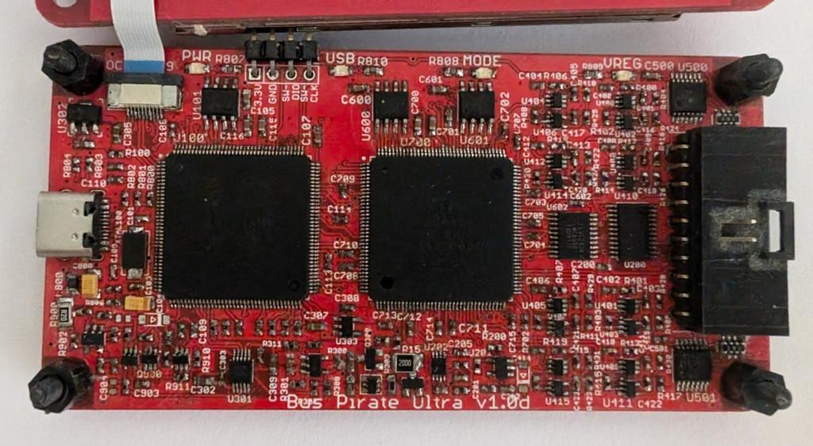

The first attempt at a Bus Pirate 5 used an FPGA and was capable of having a follow along logic analyzer. After the supply chain crisis hit those parts became unobtainable. When the RP2040 came along, it just didn’t have enough pins to support one. That long term goal is finally realized with the RP2350B.

## How it went down

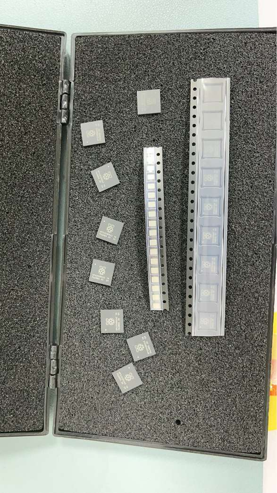

Someone suggested we contact Raspberry Pi about their beta program in mid June. End of June Raspberry Pi read us into the program and sent a handful of chips, some not yet processed into reels.

Over the first few days of July we routed PCBs for 5XL and 6. Two revisions of each – one with LDO and one with the SMPS. About a week later assembled boards arrived to me.

Over a weekend  I ported the firmware to the new hardware and the PICO 2.0 SDK. The SDK beta was solid. I had two issues that were due to me not changing the chip type for the B version, so the extra pins didn’t work as expected. There is also a new configuration step for using the PIO with >32 pins that I overlooked. I did find an SDK bug related to the new PWM modules which Rpi quickly fixed. 

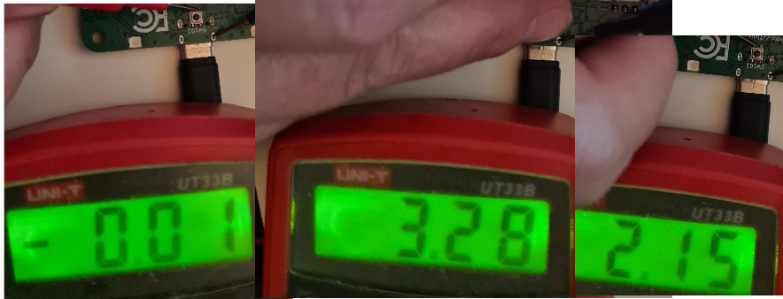

I also found a silicon bug. When a GPIO pin is configured as an input with its pull-down resistor enabled, it acts like a bus hold. We use the pull-down on the button, which connects to 3.3volts when pressed. During the self-test pressing the button works, but then it never goes low again, it sits at 2.15volts. 

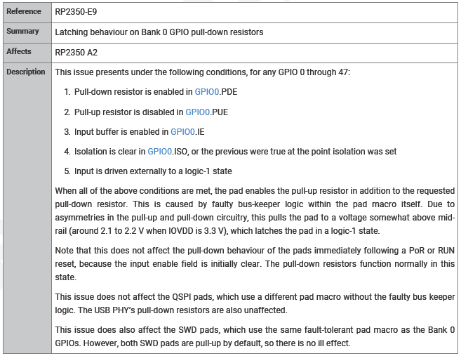

I know the dreaded 2.15volts because my logic analyzer has bus hold pins that sit at 2.15volts when connected to the Bus Pirate. It freaks me out every time. Rpi confirmed the issue and added it to the datasheet. Shout out to @henrygab because his cleanup of the self-test made finding this bug instantly possible.

The PCB was revised so the button uses the pull-up and connects to ground, but we also rely heavily on the pull-downs when doing open collector bus types. The pull-down holds the IO pin low behind the buffer, so the PIO can just manipulate the buffer direction without also managing the GPIO direction. Boards will have 100K GPIO pull-downs installed (instead of the usual 1M ohm) until there is a solution.

Late July we designed new packaging and had it printed. All three Bus Pirates (5/5XL/6) were accepted into the new “Partner with Pi” program, so you may see their logo around from time to time.

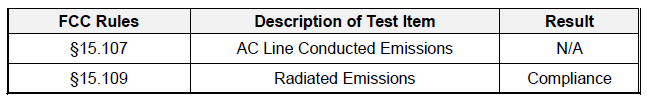

In the final days of July we passed FCC and CE testing on both boards and geared up production. By a minor miracle hardware is done and at packaging. Orders should start shipping on Monday.

- [Bus Pirate 5XL](https://dirtypcbs.com/store/designer/details/ian/6666/bus-pirate-5xl-rp2350a-with-enclosure)
- [Bus Pirate 6](https://dirtypcbs.com/store/designer/details/ian/6667/bus-pirate-6-rp2350b-with-enclosure)

import FooterCart from '/_common/_footer/_footer-cart.md' 

<FooterCart/>

We have a very small quantity of chips, and it's not clear when we'll get more. 

## Conclusion

It was super exciting to see behind the scenes and work with Rpi on launching a new chip. Thank you to them for giving me the opportunity (and the free chips). It was also really exhausting because I had to keep it all a secret. I’m super proud of our whole team for bringing two new boards into production in 6 weeks. Way to go everyone!

## Resources

- [Join the discussion in the forum](https://forum.buspirate.com/t/rp2350-bus-pirate-5xl-and-6)
- [Bus Pirate 5XL hardware](https://github.com/DangerousPrototypes/BusPirate5-hardware/tree/main/pcb/5XL-REV0)
- [Bus Pirate 6 hardware](https://github.com/DangerousPrototypes/BusPirate5-hardware/tree/main/pcb/6-REV2b)
- [RP2350 datasheet](https://datasheets.raspberrypi.com/rp2350/rp2350-datasheet.pdf)